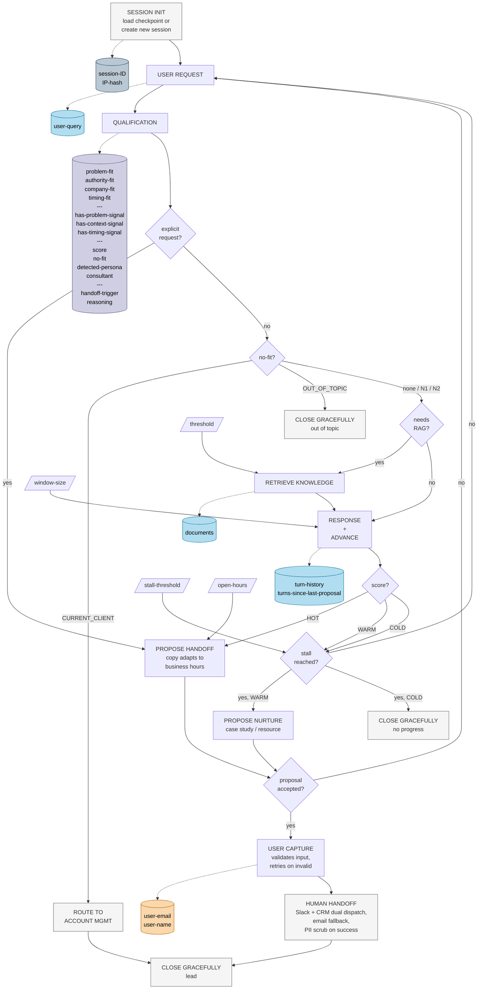

# Growth Chat Orchestrator

**Status:** In progress
**Date:** May 2026
**Decision owner:** AI Engineering Lead
**Participants:** AI Engineering Lead, Engineering Lead, Product Manager

The Growth Chat orchestrator controls the full lifecycle of a user conversation, from the initial session check through lead qualification and, when appropriate, handoff to a human consultant.

Each turn the system updates qualification state, decides whether to retrieve domain knowledge, generates a response, and routes the conversation based on the resulting lead score. When a strong qualification signal is detected, when the user explicitly requests a human, or when a stalled warm lead is detected, the system surfaces a proposal and — if accepted — collects contact details and dispatches the lead to the sales team.

This document is the MVP specification. It defines the minimum control flow and state required to satisfy the documented behaviour. Implementation details — copy, retry policies, business-hours detection, persistence backend, error handling — live elsewhere. See the *References* and *Out of scope* sections at the end of this document.

## Conversation diagram



## Legend

- **Grey rectangles** (terminals): start/end nodes (`SESSION INIT`, `CLOSE GRACEFULLY`, `HUMAN HANDOFF`, `ROUTE TO ACCOUNT MGMT`).
- **White rectangles**: orchestrator processes.
- **Diamonds**: decision nodes — binary or multi-branch (e.g. `score?`, `no-fit?`).
- **Cylinders**: persistent state variables, grouped by colour (Session / Conversation / Qualification / Capture).
- **Parallelograms**: external parameters / configuration (`threshold`, `stall-threshold`, `window-size`, `open-hours`).
- **Solid arrows**: control flow.
- **Dashed arrows**: state writes.

## Nodes

### SESSION INIT

Starts and retrieves the conversation session. Reads existing state from the checkpointer if a `session-ID` is present, otherwise creates a new session and generates the session ID.

### USER REQUEST

Gets user input. Persists `user-query` into state.

### QUALIFICATION

Runs every turn. Updates qualification state and detects whether the user is asking explicitly for a human:

- Sets the four fit dimensions (`problem-fit`, `authority-fit`, `company-fit`, `timing-fit`).
- Sets the three Stage 3 maturity signals (`has-problem-signal`, `has-context-signal`, `has-timing-signal`).
- Sets `score` (HOT | WARM | COLD), `no-fit` category if applicable (CURRENT_CLIENT | RESEARCHER | COMPETITOR | OUT_OF_TOPIC), `detected-persona` (P1 | P2 | P3 | N1 | N2), and the `consultant` flag if applicable.
- Sets `handoff-trigger = EXPLICIT_REQUEST` if the user asked for a human.

### explicit request?

Reads `handoff-trigger` set by `QUALIFICATION`. If `EXPLICIT_REQUEST`, jumps directly to `PROPOSE HANDOFF` — overrides qualification state.

### no-fit?

Reads the `no-fit` category set by `QUALIFICATION`:

- `CURRENT_CLIENT` → `ROUTE TO ACCOUNT MGMT` → `CLOSE_LEAD`.
- `OUT_OF_TOPIC` → `CLOSE GRACEFULLY out of topic`.
- `none`, `RESEARCHER` (N2) or `COMPETITOR` (N1) → continue conversation. The chat answers from public information for N1 and helpfully for N2 but never escalates and never requests contact information.

### needs RAG?

Decides whether the current turn requires retrieval. Questions about company work, services, case studies or expertise → retrieve. Questions about process, pricing or handoff mechanics → respond from prompt layer only.

### RETRIEVE KNOWLEDGE

Retrieves documents from the vector store based on `user-query`. Documents are added to context only if they pass the relevance `threshold` defined in configuration.

### RESPONSE + ADVANCE

Combined node implementing Stage 1 (Respond) and Stage 2 (Advance) of the three-stage model:

- **RESPONSE:** answers the question. If documents passed threshold, uses them. If no relevant documents and the question is about company domain, acknowledges the limit and offers human contact. If the question is about process / pricing / handoff, responds from prompt layer.
- **ADVANCE:** appends one question that completes the missing maturity signal (problem / context / timing). The intent is to build understanding, not to push toward capture.

Writes to `turn-history`. Increments `turns-since-last-proposal`.

### score?

Programmatic router over qualification state:

- `HOT` → `PROPOSE HANDOFF`.
- `WARM` → `stall reached?`.
- `COLD` → `stall reached?`.

The LLM does not decide to escalate.

### stall reached?

Checks `turns-since-last-proposal >= stall-threshold`. Behaviour depends on the score that routed here:

- WARM + stall → `PROPOSE NURTURE`.
- COLD + stall → `CLOSE GRACEFULLY no progress`.
- Either + no stall → return to `USER REQUEST`.

The counter is reset whenever any `PROPOSE *` node fires.

### PROPOSE HANDOFF

Surfaces the escalation proposal for HOT leads and explicit human requests. Sets `handoff-trigger` to `HOT_LEAD` or keeps `EXPLICIT_REQUEST` already set. Resets `turns-since-last-proposal`.

The copy adapts to business hours via `open-hours`: in-hours offers a call / connection, outside-hours states a next-business-morning commitment without same-day promises. The flow is the same in both cases — only the copy differs, so this is a single node, not a branch.

### PROPOSE NURTURE

Soft escalation for stalled WARM leads — typically P2. Offers a case study or resource framed as value, not as a sales push. Sets `handoff-trigger = STALL`. Resets `turns-since-last-proposal`.

### proposal accepted?

Reads the user's response to the proposal. Decline → return to `USER REQUEST` and continue conversation; the system does not re-propose immediately. Accept → continue to `USER CAPTURE`.

### USER CAPTURE

Collects email and name from the user and writes them to Capture State. Validates format internally and re-prompts on invalid input.

### HUMAN HANDOFF

Terminal node that delivers the context packet to two destinations in parallel: Slack `#new-leads` and a new CRM lead record. On retry exhaustion with at least one channel failed, falls back to `sales@` email. On dispatch confirmation, scrubs `user-email` and `user-name` from session state — the CRM record becomes the system of record for PII.

### CLOSE GRACEFULLY

Ends the conversation. Variants by reason: `out of topic`, `no progress`, `lead`. Each variant has its own copy; the orchestrator only routes by reason.

## State

| Colour | State | Variables |
| --- | --- | --- |
| Dark blue | Session State | `session-ID`, `IP-hash` |
| Light blue | Conversation State | `user-query`, `documents`, `turn-history`, `turns-since-last-proposal` |
| Lilac | Qualification State | `problem-fit`, `authority-fit`, `company-fit`, `timing-fit`, `has-problem-signal`, `has-context-signal`, `has-timing-signal`, `score`, `no-fit`, `detected-persona`, `consultant`, `handoff-trigger`, `reasoning` |
| Orange | Capture State | `user-email`, `user-name` |

Capture State is short-lived. It is populated by `USER CAPTURE` and cleared from session state by `HUMAN HANDOFF` once dual dispatch confirms delivery — the CRM record becomes the system of record for PII.

### Session State

```json
{
    "session-ID": "",
    "IP-hash": ""
}
```

### Conversation State

```json
{
    "user-query": "",
    "documents": [""],
    "turn-history": [
        { "user-query": "", "documents": [""], "response": "" }
    ],
    "turns-since-last-proposal": 0
}
```

### Qualification State

```json
{
    "problem-fit":   { "score": 0, "description": "" },
    "authority-fit": { "score": 0, "description": "" },
    "company-fit":   { "score": 0, "description": "" },
    "timing-fit":    { "score": 0, "description": "" },
    "has-problem-signal": false,
    "has-context-signal": false,
    "has-timing-signal":  false,
    "score": "COLD|WARM|HOT",
    "no-fit": "",
    "detected-persona": "",
    "consultant": false,
    "handoff-trigger": "",
    "reasoning": ""
}
```

`handoff-trigger` values: `HOT_LEAD | EXPLICIT_REQUEST | STALL`.

### Capture State

```json
{
    "user-email": "",
    "user-name": ""
}
```

Both fields are PII. They are set by `USER CAPTURE` and cleared from state by `HUMAN HANDOFF` once dual dispatch confirms delivery.

## Configuration

- **threshold**: minimum relevance score to include a retrieved document. Configurable env variable.
- **stall-threshold**: turns without a proposal that trigger the stall path. Default 6.
- **window-size**: size of the sliding context window for `turn-history`.
- **open-hours**: business hours of the sales team, timezone-aware via IANA identifier.

---

## References

This document implements behaviour and constraints defined in the project documentation. Each row maps a concept used in the diagram to its source.

### Functional and non-functional requirements (PRD)

| Concept in this diagram | Source |
| --- | --- |
| Qualification state object per session | [PRD FR-01](./product-requirements/index.md#product-requirements-document-prd-5-functional-requirements), [M3](./product-requirements/index.md#product-requirements-document-prd-4-feature-scope-moscow-41-must-have-mvp-v1) |
| Three-stage model (Respond → Advance → Propose) | [PRD FR-02](./product-requirements/index.md#product-requirements-document-prd-5-functional-requirements), [M4](./product-requirements/index.md#product-requirements-document-prd-4-feature-scope-moscow-41-must-have-mvp-v1) |
| Stage 3 proactive proposal on maturity signals | [PRD FR-05](./product-requirements/index.md#product-requirements-document-prd-5-functional-requirements) |
| Stall detection — 6+ turns without Stage 3 proposal, counter reset on proposal | [PRD FR-07](./product-requirements/index.md#product-requirements-document-prd-5-functional-requirements) |
| HOT / WARM / COLD classification | [PRD FR-08](./product-requirements/index.md#product-requirements-document-prd-5-functional-requirements-52-qualification-and-escalation) |
| Hot lead triggers escalation in same exchange | [PRD FR-09](./product-requirements/index.md#product-requirements-document-prd-5-functional-requirements-52-qualification-and-escalation) |
| Explicit human request overrides qualification state | [PRD FR-10](./product-requirements/index.md#product-requirements-document-prd-5-functional-requirements-52-qualification-and-escalation) |
| No escalation for N1, N2 or no-fit | [PRD FR-11](./product-requirements/index.md#product-requirements-document-prd-5-functional-requirements-52-qualification-and-escalation), [FR-11a](./product-requirements/index.md#product-requirements-document-prd-5-functional-requirements-52-qualification-and-escalation), [M7](./product-requirements/index.md#product-requirements-document-prd-4-feature-scope-moscow-41-must-have-mvp-v1) |
| Two-layer knowledge architecture (prompt + RAG) | [PRD FR-14](./product-requirements/index.md#product-requirements-document-prd-5-functional-requirements-53-knowledge-base-and-rag), [M2](./product-requirements/index.md#product-requirements-document-prd-4-feature-scope-moscow-41-must-have-mvp-v1) |
| RAG triggered only for domain questions | [PRD FR-15](./product-requirements/index.md#product-requirements-document-prd-5-functional-requirements-53-knowledge-base-and-rag) |
| No fabrication; offer human if no result above threshold | [PRD FR-16](./product-requirements/index.md#product-requirements-document-prd-5-functional-requirements-53-knowledge-base-and-rag) |
| Configurable relevance threshold | [PRD FR-17](./product-requirements/index.md#product-requirements-document-prd-5-functional-requirements-53-knowledge-base-and-rag) |
| Dual dispatch (Slack + CRM), email fallback, retry until both confirm | [PRD FR-19](./product-requirements/index.md#product-requirements-document-prd-5-functional-requirements-54-handoff-and-capture), [M5](./product-requirements/index.md#product-requirements-document-prd-4-feature-scope-moscow-41-must-have-mvp-v1), [M10](./product-requirements/index.md#product-requirements-document-prd-4-feature-scope-moscow-41-must-have-mvp-v1) |
| Outside-hours capture flow | [PRD FR-21](./product-requirements/index.md#product-requirements-document-prd-5-functional-requirements-54-handoff-and-capture), [FR-22](./product-requirements/index.md#product-requirements-document-prd-5-functional-requirements-54-handoff-and-capture), [M6](./product-requirements/index.md#product-requirements-document-prd-4-feature-scope-moscow-41-must-have-mvp-v1) |
| Existing client routing to account management | [PRD FR-23](./product-requirements/index.md#product-requirements-document-prd-5-functional-requirements-54-handoff-and-capture), [M8](./product-requirements/index.md#product-requirements-document-prd-4-feature-scope-moscow-41-must-have-mvp-v1) |

### Strategic and conversation design (Considerations)

| Concept in this diagram | Source |
| --- | --- |
| Helpfulness-first principle ("leads with expertise, not capture") | [chat-behaviour.md](./considerations/chat-behaviour.md) |
| Three maturity signals (problem, context, timing) for Stage 3 gating | [chat-behaviour.md — Maturity Signals](./considerations/chat-behaviour.md#chat-behaviour-maturity-signals) |
| Disqualification path — no-fit handled gracefully | [chat-behaviour.md — Disqualification Path](./considerations/chat-behaviour.md#chat-behaviour-disqualification-path) |
| Four qualification dimensions | [qualification-signals.md](./considerations/qualification-signals.md#qualification-signals-the-four-qualification-dimensions) |
| Scoring model HOT / WARM / COLD with action per level | [qualification-signals.md — The Scoring Model](./considerations/qualification-signals.md#qualification-signals-the-scoring-model) |
| Consultant pattern handling | [qualification-signals.md — Sales Team Findings](./considerations/qualification-signals.md#qualification-signals-sales-team-findings) |
| Handoff triggers — hot lead, explicit request, stall | [human-handoff.md — Handoff Triggers](./considerations/human-handoff.md#human-handoff-handoff-triggers) |
| Escalation matrix per visitor type and business hours | [human-handoff.md — Escalation Matrix](./considerations/human-handoff.md#human-handoff-escalation-matrix) |
| N1 (competitor) — public info only, no escalation | [n1-competitor.md](./user-personas/n1-competitor.md) |
| N2 (researcher) — helpful, no escalation, no contact push | [n2-curious-researcher.md](./user-personas/n2-curious-researcher.md) |

### Architecture decisions (ADRs)

| Concept in this diagram | Source |
| --- | --- |
| Checkpointer reads state at start, writes at end of each invocation | [ADR-002 — Constraints on future decisions](./architecture-decisions/ADR-002-conversation-orchestrator.md#adr-002-use-langgraph-for-conversation-orchestration-consequences-constraints-on-future-decisions) |
| RAG triage via tool use in main LLM call | ADR-003 (pending) |

### Engineering review (open concerns)

| Concept in this diagram | Source |
| --- | --- |
| Per-turn RAG decision mechanism | [EC-01](./product-requirements/engineering-review.md#engineering-review-ai-powered-lead-qualification-chat-engineering-concerns-ec-01-rag-triage-mechanism-not-specified-fr-15-gap) |
| Qualification state persistence backend | [EC-02](./product-requirements/engineering-review.md#engineering-review-ai-powered-lead-qualification-chat-engineering-concerns-ec-02-qualification-state-object-persistence-backend-not-specified-fr-01-gap) |
| Programmatic escalation trigger as graph node | [EC-03](./product-requirements/engineering-review.md#engineering-review-ai-powered-lead-qualification-chat-engineering-concerns-ec-03-programmatic-escalation-trigger-mechanism-not-specified-fr-09-gap) |
| Business hours detection — IANA timezone, DST-aware | [EC-04](./product-requirements/engineering-review.md#engineering-review-ai-powered-lead-qualification-chat-engineering-concerns-ec-04-business-hours-detection-edge-cases) |
| Configurable relevance threshold value | [EC-05](./product-requirements/engineering-review.md#engineering-review-ai-powered-lead-qualification-chat-engineering-concerns-ec-05-rag-relevance-threshold-not-specified-fr-17-gap) |
| Stall definition — 6+ turns without Stage 3 proposal | [EC-06](./product-requirements/engineering-review.md#engineering-review-ai-powered-lead-qualification-chat-engineering-concerns-ec-06-qualification-progress-not-precisely-defined-fr-07-gap) |
| Sliding window for context management | [EC-13](./product-requirements/engineering-review.md#engineering-review-ai-powered-lead-qualification-chat-engineering-concerns-ec-13-missing-conversation-turn-limit-and-context-window-strategy) |

---

## Out of scope for this document

The following concepts are referenced by the diagram but their detailed specification belongs to other documents in the project.

### Belongs to the TRD

- Concrete schema and types per qualification dimension (enum, numeric score, boolean flags).
- Persistence backend choice (Redis vs Postgres) and TTL strategy.
- Retry policies, timeouts, and exact dispatch sequencing for `HUMAN HANDOFF`.
- Business hours detection module — IANA identifier, holiday calendar.
- Rate limiting, cost controls, and abuse prevention.
- Concrete `window-size` value and full sliding-window implementation.
- PII scrubbing implementation details.
- Analytics event schema and field types.
- Performance test plan (load level for p95 TTFT verification).

### Belongs to the CDD

- Copy and tone for `PROPOSE HANDOFF` (in-hours and outside-hours variants), `PROPOSE NURTURE`, and each `CLOSE GRACEFULLY` variant.
- Persona-adaptive register for P1, P2, P3.
- N1 / N2 differentiated handling — what the chat says and avoids saying for each.
- Decline path conversational handling (after `proposal accepted? = no`).
- Consultant clarification question and follow-up.
- Pricing deflection wording.
- Edge case dialogues and QA test cases.

### Belongs to the PRD (or PRD update)

- Decline path as a formal functional requirement, including re-proposal cooldown policy.
- Persona detection priority (currently FR-06 is `Should`).

### Belongs to ADR-002 (or a new ADR)

- Final checkpointer choice and configuration.
- Dispatch retry pattern and failure-handling mechanism.

### Belongs to other system layers

- **GDPR data notice on first interaction** — frontend widget responsibility.
- **Safety / abuse handling** — system prompt (defensive prompt design) and rate limiting layer, not orchestrator logic.
- **Graceful degradation when AI service is unavailable** — frontend fallback form with submission path independent of the AI backend.
