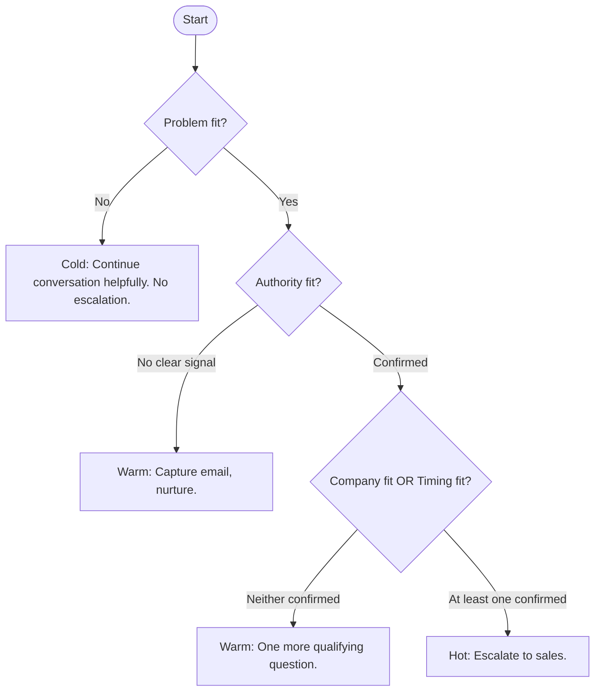

# Qualification Signals

## What the Chat Needs to Detect and When

**Project:** AI-powered lead qualification chat
**Version:** 1.0
**Status:** Draft — strategic decision, pending validation with sales team
**Last updated:** April 2026

---

## The Question

> *What qualification signals matter?
> Company size, specific needs, timeline, previous AI attempts — what does the chat
> need to collect, in what order, and how does it use that information?*

This question defines the chat's internal logic. Not its tone or personality — that is covered in `p2-helpfulness-vs-capture.md` — but the specific information the system needs to gather in order to determine whether a visitor should be escalated to sales, nurtured, or simply helped without a commercial follow-up.

---

## The Cost of Getting Qualification Wrong

There are two types of error, and they are not equally costly.

**False positive** — escalating a visitor who is not ready or not the right fit. This wastes sales team time and generates unproductive conversations. Recoverable, but annoying at scale.

**False negative** — failing to recognise a hot lead and letting them leave without escalating. This costs a real opportunity. For P1 (Evaluating CTO) and P3 (Referred Decision-Maker), this is the most expensive mistake the system can make.

The system should be calibrated to minimise false negatives on high-intent personas, even at the cost of the occasional false positive. Missing a CTO who was ready to buy is worse than sending a slightly premature lead to sales.

---

## The Four Qualification Dimensions

Not all signals carry the same weight. There are four dimensions, ordered by importance. The ordering matters because it defines the sequence in which the chat should build its picture of the visitor.

---

### Dimension 1 — Problem Fit

*Does this visitor have a problem that the company can solve?*

This is the most important signal. Without a concrete problem there is no lead, regardless of authority, company size, or timeline. A visitor who describes a specific initiative is implicitly signalling that there is work to be done.

Problem fit is the first filter. A visitor who clears it is worth continuing to qualify. A visitor who does not clear it after several exchanges should be treated as a researcher or early explorer, not a lead.

#### Explicit problem signals

| Signal type | Example phrases |
| --- | --- |
| Specific AI initiative | "We're building a RAG system for our knowledge base", "We need to add recommendation logic to our product" |
| Engineering team gap | "We don't have ML engineers internally", "Our team doesn't have AI experience yet" |
| Modernisation need | "We need to move off our legacy data pipeline", "We're rebuilding our backend and want to do it right" |
| Staff augmentation need | "We need to scale our engineering capacity fast", "We're looking for senior engineers to embed with our team" |

#### Implicit problem signals

| Observed behaviour | What it suggests |
| --- | --- |
| Asks detailed questions about a specific case study | Has a similar problem and is checking for relevant experience |
| Asks about the company's AI methodology or tooling | Evaluating technical fit for a specific use case |
| Asks about team structure or how engagements work | Has a concrete initiative and is scoping the collaboration model |
| Mentions having tried to solve the problem internally | Problem is real and persistent, not hypothetical |

---

### Dimension 2 — Authority Fit

*Can this visitor make or meaningfully influence the buying decision?*

The company engages on contracts of meaningful size. A conversation with someone who has no authority or influence over the buying decision may have nurture value but should not consume sales team time. The chat needs to build a picture of the visitor's role without asking directly — "are you the decision-maker?" is a sales script, not a conversation.

#### Explicit authority signals

| Signal type | Example phrases |
| --- | --- |
| Decision-maker | "We're evaluating vendors", "I have budget for this", "I need to make a recommendation to my board" |
| Strong influencer | "I'm putting together options for my CTO", "I'm leading the evaluation", "I'll be involved in the final decision" |
| Technical evaluator | "I'm the one who would be working with the team day-to-day" — lower authority but a useful internal champion |

#### Role inference from context

The chat should infer authority from role and language rather than asking directly.

| Mentioned role | Likely authority level |
| --- | --- |
| CTO, VP Engineering, Head of Engineering | High — likely decision-maker |
| Founder, Co-founder | High — likely decision-maker |
| VP Product, COO, Head of Digital | High — likely budget holder |
| Engineering Manager, Tech Lead | Medium — likely evaluator and influencer |
| Developer, Engineer | Low — useful technical contact, not the buyer |

---

### Dimension 3 — Company Fit

*Is this a good fit for the company?*

Company fit determines whether the engagement makes commercial sense. A solo freelancer and a 500-person scale-up have fundamentally different needs, budgets, and collaboration models.

#### Target company profiles by persona

| Persona | Company size | Stage | Industries |
| --- | --- | --- | --- |
| P1 — Evaluating CTO | 50–500 employees | Growth stage, Series B+, or established enterprise | Tech, fintech, SaaS, enterprise in digital transformation |
| P2 — Exploring Founder | 10–80 employees | Early to mid stage, pre-Series B | SaaS, marketplace, B2B product |
| P3 — Referred Decision-Maker | 100–1000 employees | Established scale-up or enterprise | Broad — referral context usually signals fit |

#### Signals

| Signal type | Example phrases |
| --- | --- |
| Company size | "We're a team of about 80 engineers", "We have around 200 people" |
| Stage or funding | "We're post-Series B", "We're bootstrapped but growing fast", "We're enterprise" |
| Industry context | "We're a fintech", "We build B2B SaaS", "We're in healthcare tech" |
| Prior vendor experience | "We've worked with nearshore teams before" — signals maturity in the engagement model |

#### Weak fit signals

The chat should note these but not immediately disqualify. Context matters.

- Very early stage with no funding context mentioned (may still be P2)
- Solo founder with no team yet (low commercial fit, but potential future lead)
- Large enterprise with very rigid procurement processes (may still convert, just slower)

---

### Dimension 4 — Timing Fit

*Is there real urgency, or is this exploratory?*

Without a timeline, there is no near-term conversion. A visitor with strong problem, authority, and company fit but no urgency is a warm lead for nurture — not for immediate escalation. A visitor with urgency signals should be escalated quickly even if the picture is not fully complete.

#### Explicit timing signals

| Signal type | Example phrases |
| --- | --- |
| Hard deadline | "We need this in production by Q3", "We're launching in six months" |
| External trigger | "We have a board meeting next week", "We just closed our Series B and need to move" |
| Active vendor evaluation | "We're talking to a few companies right now", "We want to make a decision by end of month" |
| Availability question | "When could you start?", "Do you have capacity right now?" |

#### Implicit timing signals

| Observed behaviour | What it suggests |
| --- | --- |
| Asks about team availability directly | Has a start date in mind |
| Mentions having already tried to solve the problem | Urgency is real — the workaround is not working |
| Mentions a competitor or alternative by name | Is in an active evaluation process |
| Returns to the site multiple times in a short period | High intent, building confidence before reaching out |

---

## The Scoring Model

The four dimensions combine into a three-level qualification model. The chat uses this model to determine what action to take — not what to say, which is governed by P2.

### Level definitions

| Level | Condition | Action |
| --- | --- | --- |
| **Hot lead** | Problem fit confirmed + Authority fit confirmed + at least one of (Company fit / Timing fit) | Escalate to sales immediately. Offer to connect with an engineer or book a call. |
| **Warm lead** | Problem fit confirmed + one additional dimension partially confirmed | Capture email. Offer a relevant resource or case study. Add to nurture sequence. Do not escalate yet. |
| **Cold / no lead** | No problem fit, or only general curiosity | Respond helpfully. Do not capture contact information unless volunteered. Do not escalate. |

### Detection sequence

The system evaluates dimensions in order. This is intentional — problem fit is the most efficient filter and should be resolved first.

---

## Signal Extraction — Explicit vs. Implicit

Visitors do not announce their qualification status. The system must extract signals from natural language, not from direct questions. This has direct implications for how the LLM is prompted and how the conversation is structured.

### Examples of implicit signal extraction

| What the visitor says | Signals extracted |
| --- | --- |
| "We've been trying to hire ML engineers for months and it's not working" | Problem fit (team gap) + Timing fit (ongoing frustration, implied urgency) |
| "We're a 40-person startup, pre-Series B" | Company fit (P2 profile) |
| "I need to present options to my CTO next week" | Authority fit (influencer) + Timing fit (hard deadline) |
| "We tried to build this internally and it stalled" | Problem fit (confirmed, persistent) + Timing fit (implicit urgency) |
| "Do you have availability in Q2?" | Timing fit (explicit, near-term) |

### What the system must not do

- Ask all four dimensions in sequence as explicit questions. This feels like a form and breaks the conversation model defined in P2.
- Require a visitor to self-identify their role or authority before answering their question.
- Treat absence of a signal as disqualification. Absence means the picture is incomplete, not that the visitor is not a lead.
- Ask about budget directly. Budget is inferred from company size, stage, and initiative scope — never asked.

---

## Edge Cases

### Visitor has problem fit and timing fit but unclear authority

Treat as warm-to-hot. Capture email and offer to connect them with the right person at the company. The sales team can determine authority in the first conversation.

### Visitor has strong authority but no clear problem

This is the P3 pattern — referred decision-maker who is confirming fit, not describing a problem. Treat as hot based on referral context and authority alone. Ask one open question to surface the initiative rather than disqualifying.

### Visitor is a P2 (Exploring Founder) with no timing fit

Expected. P2 rarely has timing fit in the first conversation. Treat as warm, capture email, nurture. Do not push for a call — it will feel premature and damage trust.

### Visitor gives contradictory signals

For example: describes a large-scale initiative but mentions being a solo developer. Hold the qualification. Ask one clarifying question before deciding. Do not assume.

---

## Implications for the PRD

- The LLM must be prompted to extract the four qualification dimensions from natural language, incrementally across the conversation.
- The system needs a qualification state object that tracks which dimensions have been confirmed, partially confirmed, or not yet detected.
- The escalation trigger (hot lead) must be programmatic — not left to the LLM to decide ad hoc.
- The chat must never ask about budget directly. Budget fit is inferred, not elicited.
- The sales team should be consulted to validate the hot lead threshold — specifically, whether problem + authority + one more dimension is the right bar, or whether the threshold should be higher or lower based on the company's current pipeline needs.

---

## Open Questions for Sales Team Validation

- [ ] What is the minimum signal set that makes a lead worth a sales team conversation?
- [ ] Are there industries or company types that consistently underperform even when signals are strong?
- [ ] What is the most common reason a qualified lead does not convert after the first sales call?
- [ ] Should company size be a hard filter or a soft signal? (i.e. is a 10-person team ever a good lead?)
- [ ] How should the system handle visitors who identify as freelancers or independent consultants evaluating the company for a client?

---

*This document records the strategic decision on qualification signals for the chat system. It defines the four dimensions of fit, the scoring model, and the escalation logic. It feeds directly into the conversation state management and escalation architecture defined in the PRD.*
