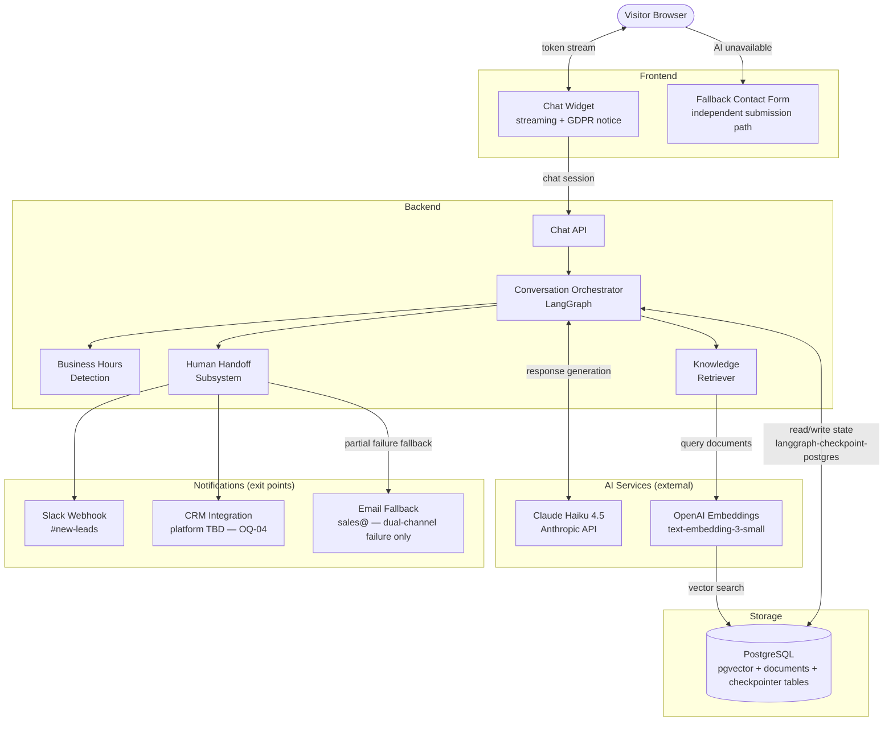
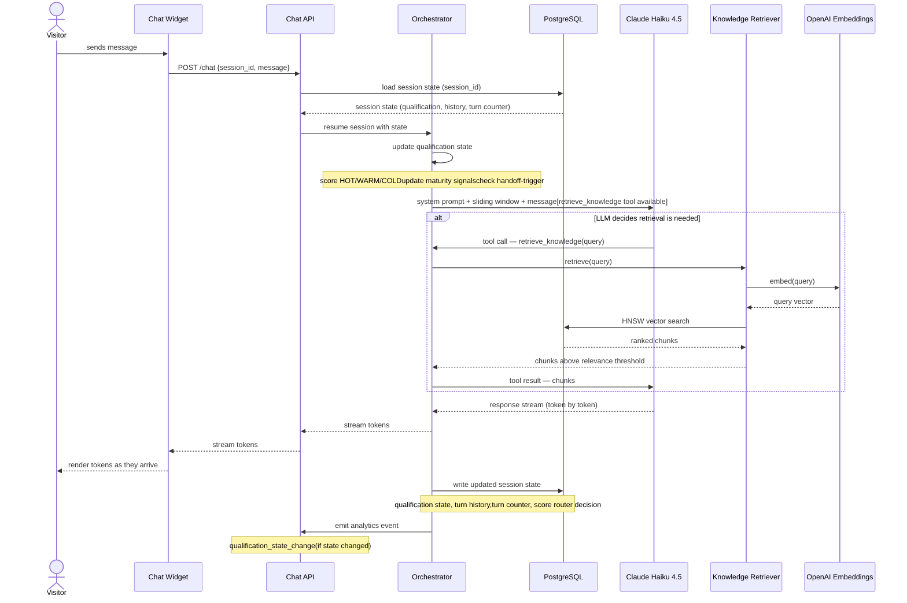

# Technical Requirements Document

## AI-Powered Lead Qualification Chat

**Project:** Zartis — Website Growth Chat
**Version:** 0.1
**Status:** `Draft`
**Last updated:** 2026-05-06
**Author:** AI Engineering Lead
**Reviewers:** Engineering Lead, Product Manager

> **Relationship to other documents:**
>
> - This TRD implements the requirements defined in the PRD (AI-Powered Lead Qualification Chat v1.0).
> - Technology decisions referenced here are recorded in ADR-001, ADR-002, and ADR-003.
> - This document does not repeat the rationale for decisions — it specifies the implementation that results from them.
> - Engineering concerns raised in the Engineering Review (April 2026) are explicitly resolved in Section 11.

---

## 1. Purpose and Scope

### 1.1 Purpose

This document specifies the technical requirements for the Zartis AI-powered lead qualification chat. It translates the product requirements defined in the PRD into precise technical specifications that the engineering team can implement directly. It resolves the open engineering concerns (EC-01 through EC-13) identified in the Engineering Review, and defines the contracts — schemas, interfaces, logic, and configuration — that govern the system's behaviour.

This document is the authoritative technical specification. Any change to the architecture described here requires a corresponding ADR and a version increment to this document.

### 1.2 Scope

**In scope:**

- Conversation orchestration graph: session lifecycle, qualification state machine, stage routing, stall detection
- LLM integration: prompt structure, function calling for RAG triage, response validation
- RAG pipeline: retrieval decision mechanism, embedding, vector search, relevance threshold
- Human handoff subsystem: escalation trigger, context packet generation, Slack and CRM delivery, partial failure handling
- Frontend chat widget: embedding, streaming rendering, graceful degradation fallback form
- Business hours detection module
- Analytics event schema and logging contracts
- Performance requirements and load test plan
- Security and GDPR requirements
- Rate limiting, cost controls, and context window strategy

**Out of scope:**

- Knowledge base content production — owned by the content workstream (OQ-01); this TRD specifies the ingestion format and pipeline, not the content itself
- CRM platform implementation details — dependent on OQ-04 (platform TBC); the integration interface is specified here, the CRM-specific configuration is not
- A/B testing infrastructure — not in scope for MVP
- Existing client support routing beyond the no-fit detection path already defined in the PRD

### 1.3 Inputs

| Input document | Description |
| --- | --- |
| PRD v1.0 — AI-Powered Lead Qualification Chat | Product requirements, functional and non-functional requirements, definition of done |
| Engineering Review — April 2026 | 13 engineering concerns assessed against the PRD; several resolved in the PRD update, remainder resolved in this TRD |
| ADR-001 — LLM Provider | Decision to use Anthropic Claude Haiku 4.5 via direct API as sole production LLM |
| ADR-002 — Conversation Orchestrator | Decision on orchestration framework and graph structure |
| ADR-003 — pgvector + OpenAI Embeddings | Decision on vector store and embedding model for RAG |
| chat-behaviour.md | Three-stage conversation model, maturity signals, disqualification paths |
| qualification-signals.md | Qualification dimensions, programmatic escalation rules |
| human-handoff.md | Context packet schema, handoff routing logic, outside-hours handling |
| chat-orchestrator-diagram.md | Orchestrator flowchart — MVP control flow and state reference |

---

## 2. System Architecture

### 2.1 High-Level Architecture

The system consists of eight components. The chat widget is the sole entry
point for visitor traffic. All AI processing runs server-side; the widget
receives a token stream. The Knowledge Retriever executes vector search when
the LLM determines domain content is required. Two external notification
channels (Slack and CRM) are exit points for lead data. The fallback form
operates independently of the AI backend.

> **One component has a pending decision that affects this diagram:**
>
> - **CRM platform (OQ-04):** Platform unconfirmed — owned by ops/commercial.
>   The Human Handoff Subsystem interface is specified in Section 3.4;
>   the CRM-specific adapter and lead record schema are defined in ADR-005
>   once OQ-04 is resolved. This blocks Section 5.2 and Phase 3 build.

---

### 2.2 Component Responsibilities

| Component | Responsibility | Technology | References |
| --- | --- | --- | --- |
| Chat Widget | Embeds on the Zartis website; renders the conversation UI with streaming token display; shows GDPR data notice on first interaction; falls back to the contact form if the AI backend is unavailable | Custom JS / framework TBD | ADR (pending) |
| Fallback Contact Form | Captures visitor name and email when the AI service is unavailable; submits via a path independent of the AI backend | Static endpoint / third-party form service | EC-07 |
| Chat API | Authenticates the request, initiates or resumes a LangGraph session, pipes the token stream to the HTTP response | Backend API layer | ADR (pending) |
| Conversation Orchestrator | Controls the full session lifecycle: qualification state updates, RAG triage routing, response generation, stall detection, escalation trigger | LangGraph (`StateGraph`) | ADR-002 |
| Knowledge Retriever | Receives `retrieve_knowledge` tool calls from the LLM; embeds the query; executes HNSW vector search against pgvector; returns chunks above the relevance threshold | Internal module — pgvector + OpenAI Embeddings | ADR-003 |
| Business Hours Detection | Determines whether the current timestamp falls within business hours (Mon–Fri 09:00–18:00 CET/CEST); DST-aware via IANA identifier `Europe/Madrid` | Python `zoneinfo` | EC-04 |
| Human Handoff Subsystem | Generates the context packet; dispatches to Slack and CRM in parallel; handles partial failure; falls back to email on dual-channel failure | Internal module | EC-03, FR-19 |
| LLM — Claude Haiku 4.5 | Generates conversational responses; executes the three-stage conversation model; signals when domain retrieval is required via `retrieve_knowledge` tool call | Anthropic API | ADR-001 |
| OpenAI Embeddings | Converts query text to vectors at retrieval time; indexes document chunks at ingestion time | `text-embedding-3-small` | ADR-003 |
| PostgreSQL | Single storage backend: pgvector extension for document chunks and HNSW index; `langgraph-checkpoint-postgres` tables for session state | PostgreSQL + pgvector | ADR-003, ADR-004 |

---

### 2.3 Data Flow — Happy Path

The following steps describe the primary data flow for a standard visitor
turn that requires domain knowledge retrieval. Handoff and degradation flows
are specified in Sections 3.4 and 10 respectively.

1. **Visitor sends a message.** The chat widget sends a chat session request
   with `{ session_id, message }` to the Chat API.

2. **Session load.** The checkpointer loads existing session state for
   `session_id` from PostgreSQL, or initialises a new session object if
   none exists. State includes qualification dimensions, maturity signals,
   turn counter, and conversation history (sliding window).

3. **Qualification node.** The orchestrator updates the qualification state
   based on the current message and conversation history. It sets `score`
   (HOT / WARM / COLD), updates maturity signal flags, and sets
   `handoff-trigger` if an explicit escalation request is detected.

4. **Response generation.** The orchestrator sends the full context (system
   prompt + sliding window + current message) to Claude Haiku 4.5 with the
   `retrieve_knowledge` tool available. The LLM decides per-turn whether to
   call the tool based on whether the question requires company domain content.

5. **Vector retrieval (conditional).** If the LLM calls `retrieve_knowledge`,
   the Knowledge Retriever embeds the query via `text-embedding-3-small`, runs
   HNSW vector search against pgvector, and returns chunks that exceed the
   configured relevance threshold. Below-threshold results are discarded. The
   orchestrator forwards the retrieved chunks to the LLM for final response
   generation.

6. **Token stream delivery.** The LLM streams the response token-by-token.
   The Chat API pipes the stream to the chat widget, which renders tokens as
   they arrive.

7. **State write.** The orchestrator writes updated session state to the
   PostgreSQL checkpointer. The `score?` router evaluates the new state and
   determines the next routing decision (return to USER REQUEST, PROPOSE
   HANDOFF, or stall path).

8. **Analytics event.** The backend emits the relevant analytics event
   (`qualification_state_change` if state changed). Event schema is defined
   in Section 9.3.

---

## 3. Component Specifications

> **[PLACEHOLDER — Section to be completed]**
>
> Una subsección por componente principal:
>
> - **3.1 Conversation Orchestrator** — grafo de estados, lógica de routing, inputs/outputs (resuelve EC-01, EC-03, EC-06)
> - **3.2 Qualification State Machine** — schema del estado, transiciones, persistencia (resuelve EC-02)
> - **3.3 RAG Triage Module** — mecanismo de decisión por turno, function calling, threshold (resuelve EC-01, EC-05)
> - **3.4 Human Handoff Subsystem** — escalation trigger programático, generación de context packet, entrega dual, partial failure (resuelve EC-03)
> - **3.5 Business Hours Detection Module** — lógica timezone-aware con IANA identifier, edge cases DST (resuelve EC-04)
> - **3.6 Context Packet Generator** — función determinista sobre session state, schema fijo
> - **3.7 Frontend Chat Widget** — embedding, streaming, fallback form (resuelve EC-07)

---

## 4. Data Models

> **[PLACEHOLDER — Section to be completed]**
>
> Esta sección definirá:
>
> - **4.1 Session State Object** — schema completo con tipos, valores permitidos y backend de persistencia (resuelve EC-02)
> - **4.2 Qualification State** — cuatro dimensiones + tres maturity signals + score + confidence como campos tipados
> - **4.3 Context Packet** — schema fijo derivado de human-handoff.md
> - **4.4 Conversation Message** — estructura de cada turno almacenado en el sliding window
> - **4.5 Lead Record** — datos capturados en handoff, campos PII identificados

---

## 5. API Specifications

> **[PLACEHOLDER — Section to be completed]**
>
> Esta sección especificará:
>
> - **5.1 Chat endpoint** — POST /chat, request/response schema, autenticación, errores
> - **5.2 Handoff webhook** — contrato de entrega a Slack y CRM, campos, reintentos
> - **5.3 Fallback form endpoint** — ruta independiente del AI backend para captura en degradación (resuelve EC-07)
> - **5.4 Interfaces internas** — contratos entre orquestador, RAG module y handoff subsystem

---

## 6. Infrastructure Requirements

> **[PLACEHOLDER — Section to be completed]**
>
> Esta sección cubrirá:
>
> - Compute: requisitos de instancia para backend y vector store
> - Storage: pgvector sizing, retención de conversaciones (90 días según PRD), backup
> - Networking: TLS 1.3, CORS para el widget embebido
> - **Environment variables completas** — todas las variables de configuración requeridas, incluyendo RAG relevance threshold (resuelve EC-05), sliding window size (resuelve EC-13), y cost limits (resuelve EC-12)

---

## 7. Performance Requirements

> **[PLACEHOLDER — Section to be completed]**
>
> Esta sección definirá:
>
> - Target TTFT p95 < 3s con streaming habilitado (resuelve EC-09 — confirmado en PRD como TTFT, no full response)
> - **Nivel de carga para el load test** — número de sesiones concurrentes sobre las que se mide el p95 (pendiente de definir, requerido por el DoD)
> - Presupuesto de latencia por etapa del pipeline RAG: embedding + vector search + LLM TTFT + network
> - Widget load time < 1s no-blocking

---

## 8. Security Requirements

> **[PLACEHOLDER — Section to be completed]**
>
> Esta sección cubrirá:
>
> - TLS 1.3 en tránsito
> - Scrubbing de PII antes de enviar historial al LLM API
> - Rate limiting por IP y por sesión (resuelve EC-12 — valores concretos)
> - GDPR: data notice en primer turno, política de retención 90 días, estado del DPA con Anthropic (EC-08 — hard blocker para producción)
> - No almacenamiento de PII en logs crudos

---

## 9. Observability

> **[PLACEHOLDER — Section to be completed]**
>
> Esta sección definirá:
>
> - **9.1 Logging** — eventos, niveles, campos y retención
> - **9.2 Metrics** — counters, gauges e histogramas con thresholds de alerta
> - **9.3 Analytics Event Schema** — schema completo a nivel de campo para todos los eventos definidos en el PRD (chat_opened, first_message_sent, qualification_state_change, contact_captured, escalation_triggered, conversation_ended), incluyendo field names, tipos y quién los dispara (frontend vs backend). Requerido antes de implementación para garantizar shapes consistentes.

---

## 10. Resilience and Degradation

> **[PLACEHOLDER — Section to be completed]**
>
> Esta sección cubrirá:
>
> - **10.1 Failure Modes** — tabla de modos de fallo por componente con comportamiento del sistema y recuperación
> - **10.2 Graceful Degradation** — fallback form con ruta de submission independiente del AI backend (resuelve EC-07); comportamiento cuando Slack falla pero CRM tiene éxito y viceversa (partial failure — resuelve FR-19)
> - **10.3 Context Window Management** — estrategia sliding window, tamaño configurable, comportamiento en límite de turno (resuelve EC-13)

---

## 11. Engineering Concerns Resolution

> **[PLACEHOLDER — Section to be completed]**
>
> Esta sección listará cada EC del Engineering Review con referencia explícita a la sección del TRD que lo resuelve. Cubrirá EC-01 a EC-13.

---

## 12. Open Questions

> **[PLACEHOLDER — Section to be completed]**
>
> Preguntas abiertas que bloquean secciones específicas del TRD:
>
> - OQ-04: CRM platform por confirmar — bloquea sección 5.2
> - OQ-05: Topic restrictions list por recibir — bloquea especificación del system prompt
> - Nivel de carga para load test (EC-09) — bloquea sección 7

---

## 13. Revision History

| Version | Date | Author | Changes |
| --- | --- | --- | --- |
| 0.1 | 2026-05-06 | AI Engineering Lead | Initial draft — header and scope |

---

*Este TRD es la especificación técnica autoritativa del sistema de chat de cualificación de leads de Zartis. Debe mantenerse actualizado a medida que se toman e implementan decisiones. Cualquier cambio que afecte a la arquitectura aquí descrita requiere un ADR correspondiente y un incremento de versión en este documento.*
