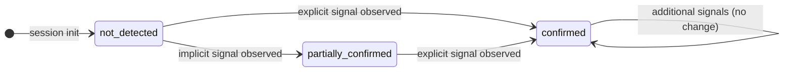
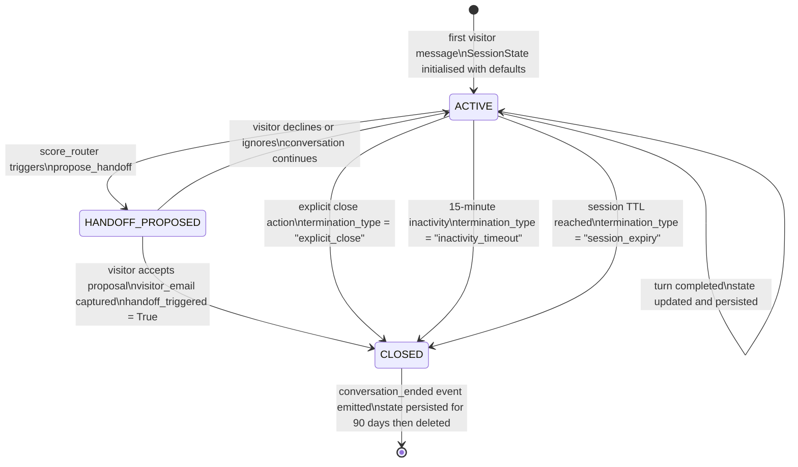
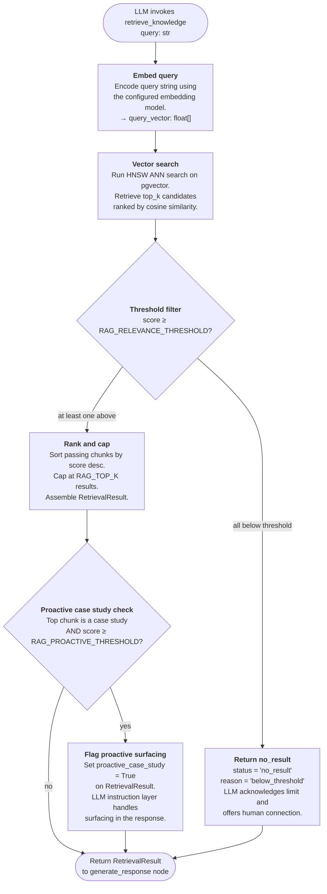

# Component Specifications

## Conversation Orchestrator

**Responsibility:** Controls the full session lifecycle — qualification state evaluation, RAG triage routing, response generation, stall detection, and programmatic escalation — as a cyclic LangGraph `StateGraph` that loops until an exit condition is met.

The orchestrator does **not** make content decisions (what to say), routing decisions based on natural language (whether to escalate), or retrieval decisions (whether to retrieve from the knowledge base). These are delegated respectively to the LLM response generation node, the programmatic `score_router` node, and the LLM's `retrieve_knowledge` tool call.

---

### Orchestrator Inputs

| Input | Type | Source | Description |
| --- | --- | --- | --- |
| `visitor_message` | `string` | Chat API | Raw text of the visitor's current turn |
| `session_id` | `string` | Chat API | Unique identifier for this conversation session; used as the LangGraph thread ID for checkpointer lookup |
| `session_state` | `SessionState` | PostgreSQL checkpointer | Full session state object loaded at the start of each turn; `None` on first turn (initialised to defaults) |

---

### Orchestrator Outputs

| Output | Type | Destination | Description |
| --- | --- | --- | --- |
| `token_stream` | `AsyncIterator[str]` | Chat API → Widget | LLM response tokens streamed as they are generated |
| `session_state` (updated) | `SessionState` | PostgreSQL checkpointer | Updated state written after every turn, before the response stream closes |
| `analytics_event` | `AnalyticsEvent` | Analytics pipeline | One event emitted per turn; event type depends on what changed (see Section 9.3) |
| `handoff_trigger` | `HandoffRequest \| None` | Human Handoff Subsystem (3.4) | Non-null when `score_router` determines escalation is required; `None` on all other turns |

---

### Graph Structure

The orchestrator is implemented as a LangGraph `StateGraph` with six nodes and a cyclic edge structure. The graph executes once per visitor turn. The normal return path after `generate_response` is back to `await_input` — the cycle continues until an exit condition is reached.


---

### Node Specifications

#### Node: `update_state`

**Type:** LLM node (structured output)

**Responsibility:** Extracts qualification signals from the visitor's message and updates the four qualification dimensions in `SessionState`. This node does not generate a visible response — its output is a structured state delta.

**Implementation:** A constrained LLM call (Claude Haiku 4.5) with a structured output schema corresponding to `QualificationDelta`. The prompt instructs the model to evaluate the message against the four dimensions and return only a JSON object with updated confidence levels. The full conversation history is not required — only the current message and the existing `QualificationState`.

**Output:** `QualificationDelta` — a partial update to `SessionState.qualification`. Fields not affected by the current message are omitted (not reset to `not_detected`).

**Confidence level transitions:**

| From | To | Example trigger |
| --- | --- | --- |
| `not_detected` | `partially_confirmed` | Visitor asks detailed questions about a specific case study (implicit problem signal) |
| `not_detected` | `confirmed` | Visitor states "we're building a RAG system for our knowledge base" (explicit problem signal) |
| `partially_confirmed` | `confirmed` | Visitor follows up with a direct statement that removes ambiguity |

Transitions are **monotonic** — a dimension that has reached `confirmed` cannot be downgraded in the same session.

---

#### Node: `score_router`

**Type:** Deterministic programmatic node (no LLM call)

**Responsibility:** Evaluates the current `SessionState` against three exit conditions and routes accordingly. This is the programmatic escalation trigger required by FR-09 and EC-03. The LLM does not participate in this decision.

**Routing logic:**

```text
inputs: SessionState

# Priority 1 — Explicit human request
if session_state.explicit_human_request == True:
    route → PROPOSE_HANDOFF
    handoff_trigger.reason = "explicit_request"

# Priority 2 — Hot lead threshold
elif qualification meets hot lead criteria:
    # Hot = Problem(confirmed) + Authority(confirmed) + (CompanyFit OR TimingFit)(any level ≥ partially_confirmed)
    route → PROPOSE_HANDOFF
    handoff_trigger.reason = "hot_lead"

# Default — continue conversation
else:
    route → GENERATE_RESPONSE
```

**Hot lead threshold (programmatic definition):**

```text
is_hot_lead(state) → bool:
    return (
        state.qualification.problem_fit == "confirmed"
        AND state.qualification.authority_fit == "confirmed"
        AND (
            state.qualification.company_fit in ["partially_confirmed", "confirmed"]
            OR state.qualification.timing_fit in ["partially_confirmed", "confirmed"]
        )
    )
```

**`explicit_human_request` detection:** Set to `True` by `update_state` when the visitor's message matches the explicit human request patterns defined in `human-handoff.md` (e.g. "can I speak to someone", "I'd rather just book a call"). Detection is performed in `update_state`, not in `score_router`, so that `score_router` remains a pure conditional node with no LLM dependency.

**Note:** `score_router` does not check the stall condition. Stall detection is the responsibility of `stall_check`, which runs after `generate_response`. This separation ensures that stall is evaluated on completed turns, not on entry.

---

#### Node: `generate_response`

**Type:** LLM node (streaming)

**Responsibility:** Generates the conversational response using Claude Haiku 4.5 with the full system prompt. May invoke the `retrieve_knowledge` tool (see Section 3.3). Streams tokens directly to the Chat API.

**System prompt layers injected at this node:**

| Layer | Content | Stable? |
| --- | --- | --- |
| Role definition | Zartis representative persona, voice and tone guidelines | Yes |
| Conversation model | Stage 1/2/3 rules, one-question-per-exchange constraint | Yes |
| Persona adaptation | Register guidance per detected visitor profile | Yes |
| Prohibited behaviours | Never fabricate, never give pricing, never reveal internal info | Yes |
| Knowledge scope | "Answer from retrieved context only; acknowledge limits honestly" | Yes |
| Handoff instructions | When escalation is appropriate (informational only — routing is programmatic) | Yes |
| Qualification state | Current `SessionState.qualification` serialised as JSON | No — injected per turn |
| Retrieved chunks | RAG results from `retrieve_knowledge` tool call, if triggered | No — injected per turn |
| Conversation history | Sliding window of last `CONTEXT_WINDOW_TURNS` exchanges (see EC-13) | No — injected per turn |

**Tool available to the LLM:**

```json
{
  "name": "retrieve_knowledge",
  "description": "Retrieve relevant information from the Zartis knowledge base. Call this tool when the visitor asks about Zartis services, case studies, team expertise, engagement models, or any question that requires specific company information beyond what is in your instructions.",
  "input_schema": {
    "type": "object",
    "properties": {
      "query": {
        "type": "string",
        "description": "The search query to use for retrieval. Should be a precise restatement of what the visitor needs to know."
      }
    },
    "required": ["query"]
  }
}
```

If the LLM calls `retrieve_knowledge`, execution pauses, the Knowledge Retriever (Section 3.3) executes the search, and the results are injected back into the LLM context before generation continues. This is a single tool call per turn — the orchestrator does not support chained tool calls in v1.

**Stage enforcement:** The system prompt instructs the LLM to follow the Stage 1 → Stage 2 → Stage 3 sequence. Stage 3 proposals are generated only in `propose_handoff`, not in `generate_response`. If the LLM attempts to generate a Stage 3 proposal in `generate_response` (i.e. when `score_router` has not triggered `propose_handoff`), this is a prompt compliance failure — logged as a `prompt_compliance_violation` event and flagged for eval review. No automated correction in v1.

---

#### Node: `stall_check`

**Type:** Deterministic programmatic node (no LLM call)

**Responsibility:** Increments the session turn counter and evaluates whether the stall condition has been reached.

**Stall definition (EC-06, PRD FR-07):** A session is stalled when `turn_counter >= STALL_TURN_THRESHOLD` **and** no Stage 3 proposal has been issued in the current session. The counter resets to `0` each time a Stage 3 proposal is issued (in `propose_handoff`).

```text
inputs: SessionState

state.turn_counter += 1

if state.turn_counter >= STALL_TURN_THRESHOLD and state.stage3_proposals_issued == 0:
    route → PROPOSE_HANDOFF
    handoff_trigger.reason = "stall"
else:
    route → WRITE_STATE
```

**Configuration:** `STALL_TURN_THRESHOLD` is a configurable environment variable (default: `6`). See Section 6 — Environment Variables.

**Stall proposal behaviour:** When stall is detected, `propose_handoff` generates a lower-friction offer — a relevant resource, a case study, or an invitation to return when the initiative is more defined — rather than a direct sales escalation. The stall path does not trigger a Slack notification or CRM record unless the visitor accepts and provides an email. This is distinct from the hot lead and explicit request paths, which always trigger the full handoff sequence.

---

#### Node: `propose_handoff`

**Type:** LLM node (streaming) + side effect

**Responsibility:** Generates a Stage 3 proposal response appropriate to the handoff reason, emits a `HandoffRequest` to the Human Handoff Subsystem (Section 3.4), and resets the stall counter.

**Proposal content by handoff reason:**

| Reason | Business hours | Outside hours |
| --- | --- | --- |
| `hot_lead` | Offer direct connection with the team; collect email | Acknowledge unavailability; state specific follow-up commitment (next business day before 10:00 CET); offer relevant resource |
| `explicit_request` | Acknowledge request immediately; collect email | Same outside-hours pattern as hot lead |
| `stall` | Lower-friction offer: relevant resource, case study, or invitation to return; email optional | Same — email capture only if visitor accepts |

**Side effects:**

1. Emits `HandoffRequest` to Human Handoff Subsystem. Includes `handoff_reason`, current `SessionState`, and `business_hours: bool` from Business Hours Detection Module (Section 3.5).
2. Resets `state.turn_counter = 0` and increments `state.stage3_proposals_issued`.

The `propose_handoff` node routes unconditionally to `write_state` after execution. There is no loop-back from `propose_handoff` — subsequent visitor turns re-enter the graph at `update_state` as normal.

---

#### Node: `write_state`

**Type:** Deterministic programmatic node (no LLM call)

**Responsibility:** Persists the updated `SessionState` to the PostgreSQL checkpointer and emits the appropriate analytics event.

**Operations (in order):**

1. Write `SessionState` to `langgraph-checkpoint-postgres` using the session's `thread_id`.
2. Determine the analytics event type based on what changed in this turn (see Section 9.3).
3. Emit the analytics event to the analytics pipeline.
4. Signal turn completion to the Chat API (stream closed).

**Failure behaviour:** If the checkpointer write fails, the turn is still considered complete from the visitor's perspective (the response has already streamed). The failure is logged as `checkpointer_write_failure` at ERROR level with the `session_id` and the failed state snapshot. The session continues — the next turn will load the last successfully persisted state, potentially losing the current turn's state update. This is a known limitation of the v1 architecture. A retry mechanism is not implemented in v1.

---

### Orchestrator Error Handling

| Error condition | Behaviour | Recovery |
| --- | --- | --- |
| `update_state` LLM call fails or times out | Log `state_extraction_failure`; proceed to `score_router` with unchanged `SessionState` | None — turn continues with stale state; next turn retries extraction |
| `generate_response` LLM call fails | Log `llm_generation_failure`; return a graceful fallback message: *"I'm having trouble responding right now — can I connect you with the team directly?"*; route to `propose_handoff` with `reason = "llm_failure"` | The fallback message itself triggers a capture handoff |
| `generate_response` stream timeout (> `LLM_STREAM_TIMEOUT_MS`) | Close stream; emit `stream_timeout` event; return fallback message as above | Same as LLM call failure |
| `retrieve_knowledge` tool call returns no results above threshold | Log `rag_no_result`; proceed with response generation without retrieved context; LLM is instructed to acknowledge the knowledge limit | None required — LLM handles gracefully via prompt instruction |
| `write_state` checkpointer write fails | Log `checkpointer_write_failure` at ERROR; session continues with stale persisted state | Next turn loads last good state; current turn's qualification progress may be lost |
| `propose_handoff` HandoffRequest delivery fails | Handoff Subsystem handles retry and partial failure (Section 3.4); orchestrator is not blocked | Orchestrator receives acknowledgement of dispatch, not of delivery |

---

### Orchestrator Configuration

All thresholds and limits are configurable environment variables. Default values are specified here; tuned values are determined during Phase 4 and documented in the ADR or a separate configuration changelog.

| Variable | Default | Description |
| --- | --- | --- |
| `STALL_TURN_THRESHOLD` | `6` | Number of turns without a Stage 3 proposal before stall is declared |
| `CONTEXT_WINDOW_TURNS` | `10` | Number of most recent exchanges retained in the sliding window passed to the LLM (EC-13) |
| `LLM_STREAM_TIMEOUT_MS` | `8000` | Maximum milliseconds to wait for the first token before declaring a stream timeout |
| `MAX_TOOL_CALLS_PER_TURN` | `1` | Maximum `retrieve_knowledge` invocations per turn; additional calls are ignored and logged |

---

### Orchestrator Dependencies

| Dependency | Component | Interface |
| --- | --- | --- |
| LLM — Claude Haiku 4.5 | External — Anthropic API | `anthropic.Anthropic().messages.stream()` with `tools` parameter |
| Qualification State persistence | PostgreSQL + `langgraph-checkpoint-postgres` | `BaseCheckpointSaver` interface (ADR-004) |
| Knowledge Retriever | Internal — Section 3.3 | `retrieve_knowledge(query: str) → list[Chunk]` |
| Human Handoff Subsystem | Internal — Section 3.4 | `dispatch_handoff(HandoffRequest) → None` (fire-and-forget from orchestrator perspective) |
| Business Hours Detection | Internal — Section 3.5 | `is_business_hours() → bool` |
| Analytics pipeline | Internal | `emit_event(AnalyticsEvent) → None` |

---

*Engineering concerns resolved by this section: EC-01 (RAG triage mechanism — `retrieve_knowledge` tool use in `generate_response`), EC-03 (programmatic escalation trigger — `score_router` node with no LLM participation), EC-06 (stall detection — PRD definition adopted: counter resets on Stage 3 proposal; threshold configurable via `STALL_TURN_THRESHOLD`).*

> - **3.3 RAG Triage Module** — mecanismo de decisión por turno, function calling, threshold (resuelve EC-01, EC-05)
> - **3.4 Human Handoff Subsystem** — escalation trigger programático, generación de context packet, entrega dual, partial failure (resuelve EC-03)
> - **3.5 Business Hours Detection Module** — lógica timezone-aware con IANA identifier, edge cases DST (resuelve EC-04)
> - **3.6 Context Packet Generator** — función determinista sobre session state, schema fijo
> - **3.7 Frontend Chat Widget** — embedding, streaming, fallback form (resuelve EC-07)

---

## Qualification State Machine

**Responsibility:** Defines the complete schema of the `SessionState` object — the single source of truth for all per-session data — and specifies the rules governing state transitions, persistence, and session lifecycle.

The qualification state machine does **not** decide what to say to the visitor, generate responses, or trigger side effects. It is a pure data contract. The Conversation Orchestrator (Section 3.1) reads and writes this state; the `score_router` node evaluates it to make routing decisions; the Context Packet Generator (Section 3.6) reads it to produce handoff data.

---

### SessionState Schema

`SessionState` is the typed dict passed as LangGraph graph state. All fields are present from session initialisation; no field is nullable unless explicitly marked.

```text
SessionState {

  # ── Session identity ────────────────────────────────────────────
  session_id          : str          // UUID; used as LangGraph thread_id
  created_at          : datetime     // UTC timestamp of first turn
  last_updated_at     : datetime     // UTC timestamp of last completed turn

  # ── Conversation history (sliding window) ───────────────────────
  messages            : list[Message]
  // Sliding window of the last CONTEXT_WINDOW_TURNS exchanges.
  // Each entry is a Message (see 3.2.2).
  // Oldest entries are evicted when the window is full (EC-13).

  # ── Qualification state ──────────────────────────────────────────
  qualification       : QualificationState
  // See 3.2.3 for full schema and transition rules.

  # ── Session control ──────────────────────────────────────────────
  lead_level          : "hot" | "warm" | "cold"   // default: "cold"
  current_stage       : 1 | 2 | 3                 // default: 1
  turn_counter        : int                        // default: 0; resets on Stage 3 proposal
  stage3_proposals_issued : int                    // default: 0; incremented in propose_handoff
  explicit_human_request  : bool                   // default: False; set by update_state

  # ── Visitor data ─────────────────────────────────────────────────
  visitor_email       : str | None                 // default: None; set when captured
  visitor_name        : str | None                 // default: None; set when volunteered
  visitor_company     : str | None                 // default: None; set when mentioned
  visitor_role        : str | None                 // default: None; inferred or stated
  is_consultant       : bool                       // default: False; see edge case below
  referral_mentioned  : bool                       // default: False

  # ── Session outcome ──────────────────────────────────────────────
  handoff_triggered   : bool                       // default: False
  handoff_reason      : "hot_lead" | "explicit_request" | "stall" | "llm_failure" | None
  termination_type    : "explicit_close" | "inactivity_timeout" | "session_expiry" | None
}
```

---

### Message Schema

Each entry in the `messages` sliding window follows this structure:

```text
Message {
  role      : "visitor" | "assistant"
  content   : str        // raw text content of the turn
  turn_index : int       // monotonically increasing turn number within the session
  timestamp : datetime   // UTC
}
```

`turn_index` is not reset when the sliding window evicts old messages. It always reflects the absolute position in the session, allowing analytics to reason about conversation depth even after window eviction.

---

### QualificationState Schema

`QualificationState` is a nested object within `SessionState`. It tracks the four fit dimensions defined in `qualification-signals.md` and the three additional flags required for routing and handoff.

```text
QualificationState {

  # ── Four fit dimensions ──────────────────────────────────────────
  problem_fit         : ConfidenceLevel   // default: "not_detected"
  authority_fit       : ConfidenceLevel   // default: "not_detected"
  company_fit         : ConfidenceLevel   // default: "not_detected"
  timing_fit          : ConfidenceLevel   // default: "not_detected"

  # ── Disqualification flags ───────────────────────────────────────
  is_negative_persona : bool              // default: False; N1 (competitor) or N2 (researcher)
  is_no_fit           : bool              // default: False; individual scope, geo mismatch, etc.

  # ── Signals observed (audit trail) ──────────────────────────────
  signals_observed    : list[SignalEntry]
  // Append-only log of signals extracted across the session.
  // Used for context packet generation and eval debugging.
  // Not used in routing logic.
}

ConfidenceLevel : "not_detected" | "partially_confirmed" | "confirmed"

SignalEntry {
  dimension   : "problem_fit" | "authority_fit" | "company_fit" | "timing_fit"
  signal_type : "explicit" | "implicit"
  evidence    : str        // the visitor phrase or behaviour that triggered the signal
  turn_index  : int
}
```

---

### State Transition Rules

#### Confidence level transitions

Transitions are **monotonic within a session**. A dimension that has reached `confirmed` cannot be downgraded to `partially_confirmed` or `not_detected` in the same session. New evidence can only move a dimension upward.



The `update_state` node in the orchestrator is the only writer to `QualificationState` dimensions. No other node modifies these fields.

#### Lead level derivation

`lead_level` is derived from `QualificationState` by the `score_router` node at each turn. It is not stored as a persistent field — it is recomputed from the current `QualificationState` on every evaluation. The value stored in `SessionState.lead_level` reflects the last computed level and is used for context packet generation; it is not used in routing (routing always recomputes from raw dimensions).

```text
derive_lead_level(q: QualificationState) → "hot" | "warm" | "cold":

  # Disqualified sessions never escalate regardless of qualification signals
  if q.is_negative_persona or q.is_no_fit:
      return "cold"

  # Hot: Problem(confirmed) + Authority(confirmed) + (CompanyFit OR TimingFit)(≥ partially_confirmed)
  if (q.problem_fit == "confirmed"
      and q.authority_fit == "confirmed"
      and (q.company_fit in ["partially_confirmed", "confirmed"]
           or q.timing_fit in ["partially_confirmed", "confirmed"])):
      return "hot"

  # Special case: P3 pattern — referred visitor with confirmed authority
  # Referral substitutes for problem_fit in the hot threshold
  if (session_state.referral_mentioned == True
      and q.authority_fit == "confirmed"
      and (q.company_fit in ["partially_confirmed", "confirmed"]
           or q.timing_fit in ["partially_confirmed", "confirmed"])):
      return "hot"

  # Warm: Problem(confirmed) + at least one additional dimension (≥ partially_confirmed)
  if (q.problem_fit == "confirmed"
      and any dimension in [authority_fit, company_fit, timing_fit] >= "partially_confirmed"):
      return "warm"

  # Cold: default
  return "cold"
```

#### Stage transitions

`current_stage` follows the respond → advance → propose sequence defined in `chat-behaviour.md`. Stage transitions are driven by the orchestrator's routing decisions, not by a separate state update.

| Transition | Trigger |
| --- | --- |
| Stage 1 → Stage 2 | After the first substantive response has been delivered (first completed turn) |
| Stage 2 → Stage 3 | `score_router` routes to `propose_handoff` (hot lead, explicit request, or stall) |
| Stage 3 → Stage 2 | After `propose_handoff` completes, if the visitor continues the conversation without accepting the proposal |

Stage 3 is not a terminal state. If the visitor declines or ignores the handoff proposal and continues asking questions, the session returns to Stage 2 and qualification continues normally. The `stage3_proposals_issued` counter increments, and the `turn_counter` resets, but the qualification dimensions are not affected.

---

### Disqualification and Negative Persona Handling

`is_negative_persona` and `is_no_fit` are set by `update_state` when the visitor's messages match the patterns defined in `chat-behaviour.md` and the PRD (FR-11, FR-11a).

**`is_negative_persona = True`** is set when the visitor's behaviour matches N1 (competitor intelligence gathering) or N2 (researcher/journalist/student with no commercial intent). Once set, it is never unset in the same session.

**`is_no_fit = True`** is set when the visitor expresses individual contractor scope, geographic or regulatory mismatch, academic purpose, or any other context in the explicit disqualification list. Consultant/evaluator patterns are **not** no-fit — see the `is_consultant` flag.

**Effect on routing:**

- `derive_lead_level()` always returns `"cold"` when either flag is true.
- `score_router` will never route to `propose_handoff` with `reason = "hot_lead"`.
- Explicit human requests (`explicit_human_request = True`) still trigger `propose_handoff` even when `is_negative_persona` is true — refusing an explicit human request is prohibited regardless of persona (FR-10, `human-handoff.md`).

**`is_consultant = True`** is set when the visitor identifies as a freelancer or agency professional evaluating on behalf of a client. This is not a disqualification flag — it is a routing modifier. When set, `QualificationState` dimensions are evaluated against the **client's** context, not the consultant's. The context packet flags this pattern explicitly so the sales rep does not pitch the consultant as the buyer.

---

### Sliding Window — Context Window Management (EC-13)

The `messages` list is a sliding window of fixed maximum size. When the window is full and a new message is added, the oldest entry is evicted.

```text
add_message(state: SessionState, new_message: Message) → SessionState:
    state.messages.append(new_message)
    if len(state.messages) > CONTEXT_WINDOW_TURNS * 2:
        // Each turn = 2 messages (visitor + assistant)
        state.messages = state.messages[-(CONTEXT_WINDOW_TURNS * 2):]
    return state
```

**What is not lost on eviction:** `QualificationState` dimensions, `lead_level`, `turn_counter`, `stage3_proposals_issued`, `visitor_*` fields, and `signals_observed`. These are stored independently of the message window and are never evicted. The sliding window only affects the raw message history passed to the LLM.

**Configuration:** `CONTEXT_WINDOW_TURNS` is a configurable environment variable (default: `10` — meaning the last 10 visitor/assistant exchange pairs). See Section 6 — Environment Variables.

---

### Session Lifecycle



**Session TTL:** `SESSION_TTL_HOURS` (configurable, default: `24`). A session that exceeds TTL without a close event is expired and marked `termination_type = "session_expiry"`. The 15-minute inactivity timeout is enforced by the frontend widget; the backend enforces the session TTL independently.

**State retention after close:** Closed session state is retained in the PostgreSQL checkpointer for 90 days (PRD NFR 6.3), then deleted. If a lead record exists (handoff completed), the state is retained for the lifetime of the lead record, not the 90-day default.

---

### Persistence Backend

| Environment | Backend | Configuration |
| --- | --- | --- |
| Local development | `MemorySaver` (LangGraph built-in) | No configuration required; zero external dependencies |
| Staging / Production | `langgraph-checkpoint-postgres` | `CHECKPOINT_DB_URL` environment variable; `AsyncPostgresSaver.setup()` migration must run before first deployment |

State is written once per turn, at the `write_state` node, after the response stream closes. State is read once per turn at session start, before `update_state` executes.

The access pattern — one read at turn start, one write at turn end — does not require sub-millisecond latency. PostgreSQL is the correct backend at current scale (ADR-004).

**Schema migration:** `AsyncPostgresSaver.setup()` creates the `checkpoints` and `checkpoint_writes` tables in the configured database. This migration must be executed as part of the initial deployment runbook and on any environment rebuild. It is idempotent — safe to run multiple times.

---

### State Machine Error Handling

| Error condition | Behaviour | Recovery |
| --- | --- | --- |
| `update_state` produces an invalid `QualificationDelta` (missing fields, wrong types) | Log `state_update_validation_failure`; discard the delta; session continues with unchanged `QualificationState` | Next turn retries signal extraction from the full conversation context |
| Monotonicity violation attempt (dimension downgrade) | Log `qualification_monotonicity_violation` at WARN; reject the downgrade silently; keep the higher confidence level | No recovery needed — the higher level is retained |
| `is_negative_persona` and `is_no_fit` both set to `True` simultaneously | Permitted — log for analytics; `is_negative_persona` takes precedence for routing decisions | No action required |
| Checkpointer read failure at session start | Log `checkpointer_read_failure` at ERROR; initialise a fresh `SessionState`; session proceeds as a new session (state context lost) | No automated recovery — the session is effectively reset |
| `CONTEXT_WINDOW_TURNS` set to `0` or negative | Raise configuration error at startup; prevent service from starting | Fix configuration and redeploy |

---

### State Machine Dependencies

| Dependency | Component | Interface |
| --- | --- | --- |
| Conversation Orchestrator | Section 3.1 | Reads and writes `SessionState` via LangGraph state-passing contract |
| PostgreSQL checkpointer | ADR-004 | `AsyncPostgresSaver` / `BaseCheckpointSaver` |
| Context Packet Generator | Section 3.6 | Reads `SessionState` as input; produces `ContextPacket` as output |
| `score_router` node | Section 3.1 | Calls `derive_lead_level(QualificationState)` on every turn |

---

*Engineering concern resolved by this section: EC-02 (qualification state persistence backend — `MemorySaver` for development, `langgraph-checkpoint-postgres` for production, both via `BaseCheckpointSaver` interface as specified in ADR-004).*

---

## RAG Triage Module

**Responsibility:** Executes knowledge base retrieval when invoked by the `generate_response` node via the `retrieve_knowledge` tool call — embedding the query, searching the vector store, filtering results by relevance threshold, and returning ranked chunks for LLM context injection.

The RAG Triage Module does **not** decide when to retrieve — that decision is delegated to the LLM via tool-use (EC-01, ADR-003). It does not generate responses, modify `SessionState`, or communicate with the handoff subsystem. Its sole concern is: given a query string, return the highest-quality relevant chunks above the configured threshold, or signal that no qualifying result exists.

---

### Overview: The Two-Layer Knowledge Architecture

Before specifying the module, the two-layer architecture required by FR-14 must be stated explicitly, as it defines the boundary of what the RAG Triage Module handles and what it does not.

```text
┌─────────────────────────────────────────────────────────────────┐
│  Layer 1 — Prompt Layer (system prompt)                         │
│                                                                 │
│  Content: conversation behaviour, qualification logic,          │
│  stage rules, persona tone, prohibited behaviours,              │
│  handoff instructions, pricing deflection                       │
│                                                                 │
│  Stable across turns. Never contains domain facts.              │
│  Managed by: Conversation Orchestrator (Section 3.1)            │
└─────────────────────────────────────────────────────────────────┘

┌─────────────────────────────────────────────────────────────────┐
│  Layer 2 — RAG Layer (vector store)                             │
│                                                                 │
│  Content: case studies, service descriptions, team profiles,    │
│  engagement model documentation, FAQs                           │
│                                                                 │
│  Retrieved selectively per turn. The only source of             │
│  company-specific domain facts.                                 │
│  Managed by: RAG Triage Module (this section)                   │
└─────────────────────────────────────────────────────────────────┘
```

**Hard rule (FR-14):** No domain content lives in the system prompt. No behaviour instructions live in the vector store. The boundary between the two layers is an architectural constraint, not a convention — violating it collapses the hallucination control mechanism.

---

### RAG Triage Inputs

| Input | Type | Source | Description |
| --- | --- | --- | --- |
| `query` | `str` | `generate_response` node via `retrieve_knowledge` tool call | The search query produced by the LLM; a precise restatement of what the visitor needs to know |
| `top_k` | `int` | Configuration (`RAG_TOP_K`) | Maximum number of chunks to retrieve before threshold filtering |
| `threshold` | `float` | Configuration (`RAG_RELEVANCE_THRESHOLD`) | Minimum cosine similarity score for a chunk to be returned |

---

### RAG Triage Outputs

| Output | Type | Destination | Description |
| --- | --- | --- | --- |
| `retrieval_result` | `RetrievalResult` | `generate_response` node | Ranked list of qualifying chunks, or a `no_result` signal with reason |

```text
RetrievalResult {
  status   : "ok" | "no_result" | "error"
  chunks   : list[RetrievedChunk]   // empty when status != "ok"
  reason   : str | None             // populated when status != "ok"
}

RetrievedChunk {
  chunk_id    : str        // unique identifier in the vector store
  content     : str        // raw text of the chunk
  score       : float      // cosine similarity score [0.0, 1.0]
  source      : str        // document title or URL slug (e.g. "case-study-fintech-rag")
  chunk_index : int        // position of this chunk within the source document
}
```

---

### Per-Turn Retrieval Flow



---

### Retrieval Decision Mechanism (EC-01)

The retrieval decision — whether to call `retrieve_knowledge` at all on a given turn — belongs to the LLM, not to the RAG Triage Module. This is the Option C resolution of EC-01: tool-use in the main LLM call.

The `generate_response` node makes the `retrieve_knowledge` tool available to the LLM on every turn. The LLM is instructed to invoke it when the visitor's message requires company-specific domain knowledge. It does not invoke it for questions about conversation process, pricing deflection, or handoff mechanics — those are handled from the prompt layer alone.

**When the LLM should call `retrieve_knowledge`:**

| Question type | Expected LLM behaviour | Rationale |
| --- | --- | --- |
| "What case studies do you have in fintech?" | Call `retrieve_knowledge` | Requires domain content — case study library |
| "How does your team structure work?" | Call `retrieve_knowledge` | Requires domain content — engagement model documentation |
| "What AI expertise does your team have?" | Call `retrieve_knowledge` | Requires domain content — team profiles |
| "How much does it cost to work with you?" | Do NOT call | Pricing deflection is handled entirely from the prompt layer |
| "Can I speak to someone?" | Do NOT call | Handoff mechanics handled from the prompt layer |
| "What's your process for onboarding?" | Call `retrieve_knowledge` | May have domain content — engagement model documentation |

This boundary is enforced through the system prompt instruction layer, not programmatically. If the LLM calls `retrieve_knowledge` for a question that should be handled from the prompt layer (e.g. pricing), the module will return a `no_result` because the knowledge base contains no pricing content — the fallback behaviour (acknowledge limit, offer human) is appropriate either way. There is no hard error path for unnecessary tool calls in v1.

**Single tool call per turn:** The orchestrator enforces `MAX_TOOL_CALLS_PER_TURN = 1`. If the LLM attempts a second `retrieve_knowledge` call within the same turn, it is ignored and logged as `rag_extra_tool_call_ignored`.

---

### Embedding Pipeline

#### Query embedding (per turn)

| Environment | Model | Dimensions | API |
| --- | --- | --- | --- |
| Local development | `all-MiniLM-L6-v2` via `sentence-transformers` | 384 | Local — no API key required |
| Staging / Production | `text-embedding-3-small` via OpenAI API | 1,536 | OpenAI API — EU endpoint |

The embedding interface is uniform across environments via the LangChain `Embeddings` abstraction (`HuggingFaceEmbeddings` locally, `OpenAIEmbeddings` in staging/production). Swapping the implementation is a configuration change, not a code change.

**PII note:** Query strings sent to the OpenAI embedding API may contain visitor message content. The same PII scrubbing rules that apply to LLM API calls (PRD NFR 6.3) apply here. Visitor email addresses and names must be stripped from the query before embedding. The query is a restatement of the visitor's information need, constructed by the LLM — in practice it will rarely contain PII, but the scrubbing rule is unconditional.

#### Knowledge base indexing (offline, not per-turn)

Indexing runs as an offline batch process, not as part of the per-turn pipeline. It is triggered manually or by CI when the knowledge base content changes.

```text
Indexing pipeline:
  1. Load source documents (Markdown / plain text files — OQ-01 format)
  2. Chunk: RecursiveCharacterTextSplitter
       chunk_size    = CHUNK_SIZE tokens (configurable, default: 512)
       chunk_overlap = CHUNK_OVERLAP tokens (configurable, default: 64)
  3. Embed each chunk using the production embedding model (text-embedding-3-small)
  4. Upsert vectors into pgvector with metadata:
       chunk_id, source_document, chunk_index, content_hash
  5. Rebuild HNSW index if total vector count has changed materially
```

**Local vs. production index separation:** Because `all-MiniLM-L6-v2` (384 dimensions) and `text-embedding-3-small` (1,536 dimensions) produce incompatible vector spaces, the local development index and the production index are separate tables in the same PostgreSQL instance (`knowledge_chunks_dev` and `knowledge_chunks_prod`). Local indexes are never promoted to production. The production index is built in CI against the production embedding model before each deployment that changes the knowledge base.

---

### Vector Store and Search

**Backend:** pgvector extension on the shared PostgreSQL instance (ADR-003, ADR-004).

**Index type:** HNSW (`ivfflat` is not used — HNSW offers better recall at query time without requiring a vacuum/rebuild cycle as the table grows).

**Schema:**

```sql
CREATE TABLE knowledge_chunks (
  chunk_id        TEXT PRIMARY KEY,
  source          TEXT NOT NULL,        -- document title or slug
  chunk_index     INT  NOT NULL,        -- position within source document
  content         TEXT NOT NULL,        -- raw text of the chunk
  content_hash    TEXT NOT NULL,        -- SHA-256 of content; used for deduplication
  embedding       VECTOR(1536) NOT NULL, -- text-embedding-3-small dimensions
  created_at      TIMESTAMPTZ DEFAULT NOW()
);

CREATE INDEX ON knowledge_chunks
  USING hnsw (embedding vector_cosine_ops)
  WITH (m = 16, ef_construction = 64);
```

**Query:**

```sql
SELECT
  chunk_id,
  content,
  source,
  chunk_index,
  1 - (embedding <=> $query_vector) AS score
FROM knowledge_chunks
ORDER BY embedding <=> $query_vector
LIMIT $top_k;
```

The `<=>` operator computes cosine distance; `1 - distance` converts to cosine similarity in `[0.0, 1.0]`. Results are returned in ascending distance order (highest similarity first). The threshold filter is applied in application code, not in SQL, so that the raw scores are available for logging regardless of whether results pass.

**HNSW tuning parameters:** Default values (`m = 16`, `ef_construction = 64`) are appropriate for corpora under ~100K vectors. `ef_search` (query-time recall/latency trade-off) defaults to `40` and is configurable via `RAG_HNSW_EF_SEARCH`. These values should be re-evaluated during Phase 4 RAG tuning once the production knowledge base is indexed.

---

### Relevance Threshold and Result Filtering (EC-05, FR-17)

The relevance threshold is the primary quality gate. Only chunks with `score >= RAG_RELEVANCE_THRESHOLD` are included in the `RetrievalResult`. Chunks below the threshold are discarded before the result is returned to the orchestrator.

**Configuration:** `RAG_RELEVANCE_THRESHOLD` is a required environment variable. There is no hardcoded default — the service will not start if this variable is unset. This is an intentional constraint: deploying without a tuned threshold is a misconfiguration, not a safe default.

**Tuning process (Phase 4):**

```text
1. Ingest the production knowledge base (OQ-01 content)
2. Construct a representative test query set covering:
   - Questions with known relevant chunks (expected: score above threshold)
   - Questions with no relevant chunk (expected: score below threshold, no result returned)
   - Paraphrased versions of well-covered questions (tests recall robustness)
3. Run all queries, collect raw score distributions
4. Plot score histogram; identify the natural gap between relevant and irrelevant result clusters
5. Set RAG_RELEVANCE_THRESHOLD at the midpoint of that gap
6. Validate: false positive rate (irrelevant chunks above threshold) < 5%;
             false negative rate (relevant chunks below threshold) < 10%
7. Document the selected value and the score distribution plot in a configuration changelog
```

**Placeholder value for development:** `RAG_RELEVANCE_THRESHOLD = 0.70` is used during Phase 1 and Phase 2 against the synthetic placeholder knowledge base. This value is provisional and will be replaced by the tuned value in Phase 4. It must not be used in production without Phase 4 validation.

---

### No-Result Handling (FR-16)

When `RetrievalResult.status == "no_result"`, the `generate_response` node receives an empty chunk list. The system prompt instructs the LLM to handle this case explicitly:

> *"If no relevant information was retrieved from the knowledge base for this question, acknowledge the limit honestly. Do not fabricate an answer. Offer to connect the visitor with a member of the team who can give them a proper answer."*

Example compliant response:

> *"I don't have specific information on that to hand — it's not something I can answer accurately from here. The best thing would be to speak directly with one of the engineers who can give you a proper answer. Want me to arrange that?"*

The no-result path does not trigger a programmatic handoff — it is a prompt-layer instruction. If the visitor accepts the offer to speak with the team, that response becomes an `explicit_human_request` signal detected by `update_state` on the next turn, which then routes through the normal escalation path.

---

### Proactive Case Study Surfacing (FR-18)

FR-18 requires the system to surface a relevant case study proactively — without being asked — when the visitor's described problem matches a retrieved case study at high confidence.

The RAG Triage Module supports this through a secondary threshold (`RAG_PROACTIVE_THRESHOLD`) evaluated after the standard threshold filter. If the top-ranked chunk originates from a case study document (identifiable by source prefix, e.g. `"case-study-"`) and its score exceeds `RAG_PROACTIVE_THRESHOLD`, the `RetrievalResult` is flagged with `proactive_case_study = True`.

The `generate_response` node passes this flag to the LLM via the context injection. The system prompt instructs the LLM to surface the case study naturally within the response when the flag is set:

> *"If proactive_case_study is True in the retrieved context, mention the case study naturally within your response — not as a separate recommendation, but as a relevant example of similar work."*

**Configuration:** `RAG_PROACTIVE_THRESHOLD` is set higher than `RAG_RELEVANCE_THRESHOLD` to reduce false positives on proactive surfacing. Recommended starting ratio: `RAG_PROACTIVE_THRESHOLD = RAG_RELEVANCE_THRESHOLD + 0.10`. Final values determined during Phase 4 tuning.

**v1 scope note:** FR-18 is a Should requirement. The proactive surfacing mechanism is implemented in v1 if capacity allows (S3 in the MoSCoW). If deferred, the RAG Triage Module returns chunks without the `proactive_case_study` flag and S3 is tracked in the v2 backlog.

---

### Knowledge Base Content Scope (v1)

The v1 knowledge base is restricted to **publicly available content only** — content already published on the company website. No NDA-protected case studies, internal methodology documents, or unpublished material is ingested (PRD OQ-01).

**v1 knowledge base categories:**

| Category | Source | Notes |
| --- | --- | --- |
| Case studies | Public website — case study section | Summaries only if full studies are behind NDA |
| Service descriptions | Public website — services pages | |
| Team and location profile | Public website — about/team pages | No individual employee PII |
| Engagement model documentation | Public website or published blog posts | |
| FAQ content | Public website — FAQ or blog | |

**Placeholder knowledge base (Phase 1–2):** Engineering builds the ingestion pipeline and RAG architecture against a synthetic placeholder knowledge base (10–15 representative documents covering the categories above) before OQ-01 content is delivered. The placeholder is replaced by production content in Phase 4 without changes to the pipeline or schema.

---

### Performance Requirements

| Metric | Target | Notes |
| --- | --- | --- |
| p95 retrieval latency (query embedding + vector search + threshold filter) | < 500ms | Measured from tool call received to `RetrievalResult` returned |
| Embedding API call (OpenAI) | < 200ms p95 | Network-dependent; EU endpoint reduces variance |
| HNSW vector search (pgvector) | < 100ms p95 | At MVP corpus size (< 10K vectors); re-evaluate if corpus grows past 1M |

The 500ms p95 retrieval target is derived from the overall TTFT budget of 3s (PRD NFR 6.1). With streaming enabled, the remaining budget after retrieval (~2.5s) is sufficient for LLM first-token delivery under normal conditions.

---

### RAG Triage Error Handling

| Error condition | Behaviour | Recovery |
| --- | --- | --- |
| OpenAI embedding API call fails or times out | Log `embedding_api_failure`; return `RetrievalResult(status="error", reason="embedding_failure")`; `generate_response` proceeds without retrieved context (prompt-layer response only) | Next turn retries normally — no session-level impact |
| pgvector query fails (DB connection error) | Log `vector_search_failure` at ERROR; return `RetrievalResult(status="error", reason="search_failure")`; same fallback as above | Monitor DB connectivity; alert on sustained failures |
| All retrieved chunks below threshold | Return `RetrievalResult(status="no_result", reason="below_threshold")`; LLM uses prompt-layer instruction to acknowledge limit | Not an error — normal operating condition for out-of-scope questions |
| `RAG_RELEVANCE_THRESHOLD` not set at startup | Raise `ConfigurationError`; prevent service from starting | Fix configuration and redeploy |
| Chunk content is empty or corrupted in the DB | Log `corrupt_chunk_skipped` at WARN; exclude the chunk from results; continue with remaining chunks | Re-index the affected document |
| LLM issues more than `MAX_TOOL_CALLS_PER_TURN` retrieve calls | Ignore additional calls; log `rag_extra_tool_call_ignored` at WARN | Prompt engineering review; no session impact |

---

### RAG Triage Configuration

| Variable | Required | Default (dev) | Description |
| --- | --- | --- | --- |
| `RAG_RELEVANCE_THRESHOLD` | **Yes — no default** | `0.70` (provisional, Phase 1–2 only) | Minimum cosine similarity score for a chunk to be included in results. Must be tuned in Phase 4 before production deployment. |
| `RAG_PROACTIVE_THRESHOLD` | No | `RAG_RELEVANCE_THRESHOLD + 0.10` | Minimum score for a case study chunk to trigger proactive surfacing (FR-18) |
| `RAG_TOP_K` | No | `5` | Maximum number of chunks retrieved from the vector store before threshold filtering |
| `RAG_HNSW_EF_SEARCH` | No | `40` | HNSW query-time recall/latency trade-off parameter. Higher = better recall, higher latency. |
| `CHUNK_SIZE` | No | `512` | Token size for document chunking during indexing |
| `CHUNK_OVERLAP` | No | `64` | Token overlap between adjacent chunks during indexing |
| `OPENAI_EMBEDDING_MODEL` | No | `text-embedding-3-small` | OpenAI embedding model identifier (staging/production) |
| `OPENAI_EU_ENDPOINT` | No | `https://api.openai.com/v1` | Set to OpenAI EU endpoint for data residency compliance |
| `KNOWLEDGE_TABLE_NAME` | No | `knowledge_chunks` | pgvector table name; allows environment-specific tables without schema changes |

---

### RAG Triage Dependencies

| Dependency | Component | Interface |
| --- | --- | --- |
| Conversation Orchestrator | Section 3.1 — `generate_response` node | Invoked via LangGraph tool-use callback; returns `RetrievalResult` |
| PostgreSQL + pgvector | ADR-003, ADR-004 | SQL via `asyncpg` / SQLAlchemy async; LangChain `PGVector` wrapper |
| OpenAI Embeddings API | External — OpenAI | `OpenAIEmbeddings` (LangChain wrapper); EU endpoint configured via `OPENAI_EU_ENDPOINT` |
| sentence-transformers | Local dev only | `HuggingFaceEmbeddings` (LangChain wrapper); no API key |
| Indexing pipeline | Offline batch process | CLI script; not part of the per-turn request path |

---

### Compliance Notes

- Embedding requests to the OpenAI API transmit text content that may constitute personal data under GDPR Article 4. A Data Processing Addendum (DPA) with OpenAI must be executed before processing real visitor data (EC-08 equivalent for the embedding provider — distinct from the Anthropic DPA for the LLM).
- The OpenAI EU API endpoint (`api.openai.com` with EU data residency configuration) must be used in all environments that process EU visitor data.
- PII scrubbing applied to LLM API calls (PRD NFR 6.3) applies equally to embedding API calls. Visitor email addresses and names must not appear in query strings sent to the embedding API.

---

*Engineering concerns resolved by this section: EC-01 (RAG triage mechanism — `retrieve_knowledge` tool-use in the main LLM call; no separate classifier; the RAG Triage Module executes only when invoked by the LLM), EC-05 (relevance threshold — `RAG_RELEVANCE_THRESHOLD` is a required env variable with no hardcoded default; provisional value 0.70 for Phase 1–2 dev only; tuning process defined for Phase 4).*
