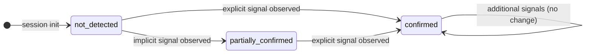
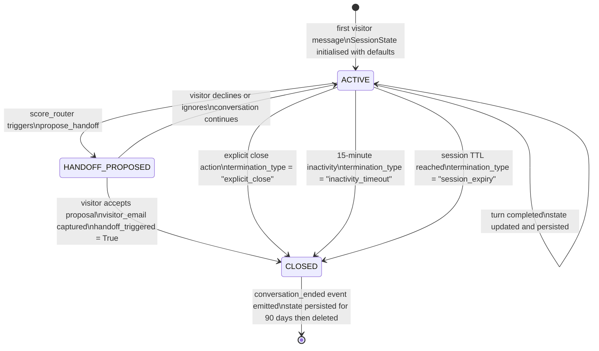
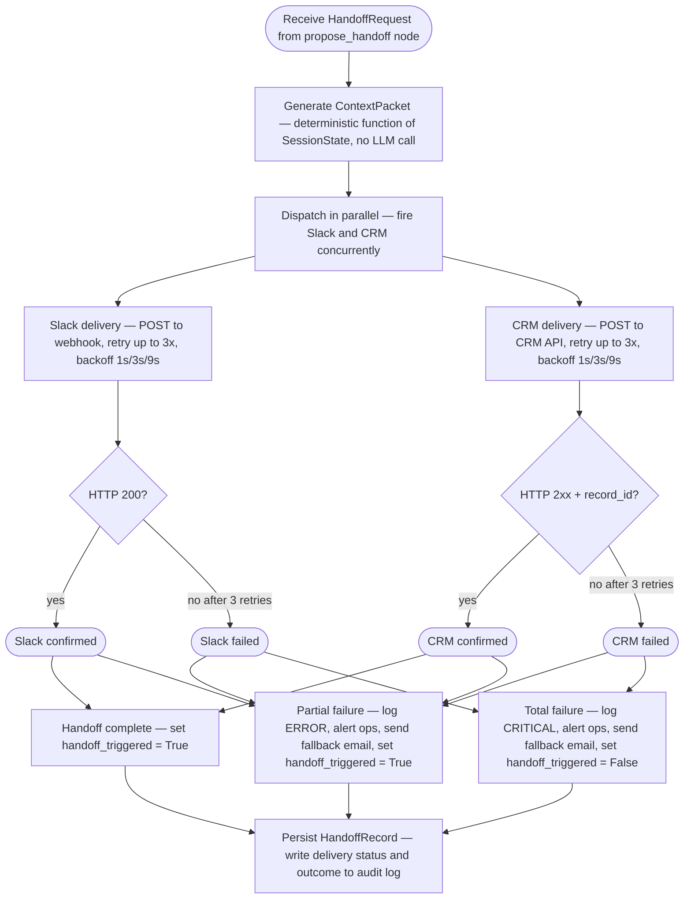

# Component Specifications

## Conversation Orchestrator

**Responsibility:** Controls the full session lifecycle — qualification state evaluation, RAG triage routing, response generation, stall detection, and programmatic escalation — as a cyclic LangGraph `StateGraph` that loops until an exit condition is met.

The orchestrator does **not** make content decisions (what to say), routing decisions based on natural language (whether to escalate), or retrieval decisions (whether to retrieve from the knowledge base). These are delegated respectively to the LLM response generation node, the programmatic `score_router` node, and the LLM's `retrieve_knowledge` tool call.

---

### Orchestrator Inputs

| Input | Type | Source | Description |
| --- | --- | --- | --- |
| `visitor_message` | `string` | Chat API | Raw text of the visitor's current turn |
| `session_id` | `string` | Chat API | Unique identifier for this conversation session; used as the LangGraph thread ID for checkpointer lookup |
| `session_state` | `SessionState` | PostgreSQL checkpointer | Full session state object loaded at the start of each turn; `None` on first turn (initialised to defaults) |

---

### Orchestrator Outputs

| Output | Type | Destination | Description |
| --- | --- | --- | --- |
| `token_stream` | `AsyncIterator[str]` | Chat API → Widget | LLM response tokens streamed as they are generated |
| `session_state` (updated) | `SessionState` | PostgreSQL checkpointer | Updated state written after every turn, before the response stream closes |
| `analytics_event` | `AnalyticsEvent` | Analytics pipeline | One event emitted per turn; event type depends on what changed (see Section 9.3) |
| `handoff_trigger` | `HandoffRequest \| None` | Human Handoff Subsystem (3.4) | Non-null when `score_router` determines escalation is required; `None` on all other turns |

---

### Graph Structure

The orchestrator is implemented as a LangGraph `StateGraph` with six nodes and a cyclic edge structure. The graph executes once per visitor turn. The normal return path after `generate_response` is back to `await_input` — the cycle continues until an exit condition is reached.


---

### Node Specifications

#### Node: `update_state`

**Type:** LLM node (structured output)

**Responsibility:** Extracts qualification signals from the visitor's message and updates the four qualification dimensions in `SessionState`. This node does not generate a visible response — its output is a structured state delta.

**Implementation:** A constrained LLM call (Claude Haiku 4.5) with a structured output schema corresponding to `QualificationDelta`. The prompt instructs the model to evaluate the message against the four dimensions and return only a JSON object with updated confidence levels. The full conversation history is not required — only the current message and the existing `QualificationState`.

**Output:** `QualificationDelta` — a partial update to `SessionState.qualification`. Fields not affected by the current message are omitted (not reset to `not_detected`).

**Confidence level transitions:**

| From | To | Example trigger |
| --- | --- | --- |
| `not_detected` | `partially_confirmed` | Visitor asks detailed questions about a specific case study (implicit problem signal) |
| `not_detected` | `confirmed` | Visitor states "we're building a RAG system for our knowledge base" (explicit problem signal) |
| `partially_confirmed` | `confirmed` | Visitor follows up with a direct statement that removes ambiguity |

Transitions are **monotonic** — a dimension that has reached `confirmed` cannot be downgraded in the same session.

---

#### Node: `score_router`

**Type:** Deterministic programmatic node (no LLM call)

**Responsibility:** Evaluates the current `SessionState` against three exit conditions and routes accordingly. This is the programmatic escalation trigger required by FR-09 and EC-03. The LLM does not participate in this decision.

**Routing logic:**

```text
inputs: SessionState

# Priority 1 — Explicit human request
if session_state.explicit_human_request == True:
    route → PROPOSE_HANDOFF
    handoff_trigger.reason = "explicit_request"

# Priority 2 — Hot lead threshold
elif qualification meets hot lead criteria:
    # Hot = Problem(confirmed) + Authority(confirmed) + (CompanyFit OR TimingFit)(any level ≥ partially_confirmed)
    route → PROPOSE_HANDOFF
    handoff_trigger.reason = "hot_lead"

# Default — continue conversation
else:
    route → GENERATE_RESPONSE
```

**Hot lead threshold (programmatic definition):**

```text
is_hot_lead(state) → bool:
    return (
        state.qualification.problem_fit == "confirmed"
        AND state.qualification.authority_fit == "confirmed"
        AND (
            state.qualification.company_fit in ["partially_confirmed", "confirmed"]
            OR state.qualification.timing_fit in ["partially_confirmed", "confirmed"]
        )
    )
```

**`explicit_human_request` detection:** Set to `True` by `update_state` when the visitor's message matches the explicit human request patterns defined in `human-handoff.md` (e.g. "can I speak to someone", "I'd rather just book a call"). Detection is performed in `update_state`, not in `score_router`, so that `score_router` remains a pure conditional node with no LLM dependency.

**Note:** `score_router` does not check the stall condition. Stall detection is the responsibility of `stall_check`, which runs after `generate_response`. This separation ensures that stall is evaluated on completed turns, not on entry.

---

#### Node: `generate_response`

**Type:** LLM node (streaming)

**Responsibility:** Generates the conversational response using Claude Haiku 4.5 with the full system prompt. May invoke the `retrieve_knowledge` tool (see Section 3.3). Streams tokens directly to the Chat API.

**System prompt layers injected at this node:**

| Layer | Content | Stable? |
| --- | --- | --- |
| Role definition | Company representative persona, voice and tone guidelines | Yes |
| Conversation model | Stage 1/2/3 rules, one-question-per-exchange constraint | Yes |
| Persona adaptation | Register guidance per detected visitor profile | Yes |
| Prohibited behaviours | Never fabricate, never give pricing, never reveal internal info | Yes |
| Knowledge scope | "Answer from retrieved context only; acknowledge limits honestly" | Yes |
| Handoff instructions | When escalation is appropriate (informational only — routing is programmatic) | Yes |
| Qualification state | Current `SessionState.qualification` serialised as JSON | No — injected per turn |
| Retrieved chunks | RAG results from `retrieve_knowledge` tool call, if triggered | No — injected per turn |
| Conversation history | Sliding window of last `CONTEXT_WINDOW_TURNS` exchanges (see EC-13) | No — injected per turn |

**Tool available to the LLM:**

```json
{
  "name": "retrieve_knowledge",
  "description": "Retrieve relevant information from the company knowledge base. Call this tool when the visitor asks about company services, case studies, team expertise, engagement models, or any question that requires specific company information beyond what is in your instructions.",
  "input_schema": {
    "type": "object",
    "properties": {
      "query": {
        "type": "string",
        "description": "The search query to use for retrieval. Should be a precise restatement of what the visitor needs to know."
      }
    },
    "required": ["query"]
  }
}
```

If the LLM calls `retrieve_knowledge`, execution pauses, the Knowledge Retriever (Section 3.3) executes the search, and the results are injected back into the LLM context before generation continues. This is a single tool call per turn — the orchestrator does not support chained tool calls in v1.

**Stage enforcement:** The system prompt instructs the LLM to follow the Stage 1 → Stage 2 → Stage 3 sequence. Stage 3 proposals are generated only in `propose_handoff`, not in `generate_response`. If the LLM attempts to generate a Stage 3 proposal in `generate_response` (i.e. when `score_router` has not triggered `propose_handoff`), this is a prompt compliance failure — logged as a `prompt_compliance_violation` event and flagged for eval review. No automated correction in v1.

---

#### Node: `stall_check`

**Type:** Deterministic programmatic node (no LLM call)

**Responsibility:** Increments the session turn counter and evaluates whether the stall condition has been reached.

**Stall definition (EC-06, PRD FR-07):** A session is stalled when `turn_counter >= STALL_TURN_THRESHOLD` **and** no Stage 3 proposal has been issued in the current session. The counter resets to `0` each time a Stage 3 proposal is issued (in `propose_handoff`).

```text
inputs: SessionState

state.turn_counter += 1

if state.turn_counter >= STALL_TURN_THRESHOLD and state.stage3_proposals_issued == 0:
    route → PROPOSE_HANDOFF
    handoff_trigger.reason = "stall"
else:
    route → WRITE_STATE
```

**Configuration:** `STALL_TURN_THRESHOLD` is a configurable environment variable (default: `6`). See Section 6 — Environment Variables.

**Stall proposal behaviour:** When stall is detected, `propose_handoff` generates a lower-friction offer — a relevant resource, a case study, or an invitation to return when the initiative is more defined — rather than a direct sales escalation. The stall path does not trigger a Slack notification or CRM record unless the visitor accepts and provides an email. This is distinct from the hot lead and explicit request paths, which always trigger the full handoff sequence.

---

#### Node: `propose_handoff`

**Type:** LLM node (streaming) + side effect

**Responsibility:** Generates a Stage 3 proposal response appropriate to the handoff reason, emits a `HandoffRequest` to the Human Handoff Subsystem (Section 3.4), and resets the stall counter.

**Proposal content by handoff reason:**

| Reason | Business hours | Outside hours |
| --- | --- | --- |
| `hot_lead` | Offer direct connection with the team; collect email | Acknowledge unavailability; state specific follow-up commitment (next business day before 10:00 CET); offer relevant resource |
| `explicit_request` | Acknowledge request immediately; collect email | Same outside-hours pattern as hot lead |
| `stall` | Lower-friction offer: relevant resource, case study, or invitation to return; email optional | Same — email capture only if visitor accepts |

**Side effects:**

1. Emits `HandoffRequest` to Human Handoff Subsystem. Includes `handoff_reason`, current `SessionState`, and `business_hours: bool` from Business Hours Detection Module (Section 3.5).
2. Resets `state.turn_counter = 0` and increments `state.stage3_proposals_issued`.

The `propose_handoff` node routes unconditionally to `write_state` after execution. There is no loop-back from `propose_handoff` — subsequent visitor turns re-enter the graph at `update_state` as normal.

---

#### Node: `write_state`

**Type:** Deterministic programmatic node (no LLM call)

**Responsibility:** Persists the updated `SessionState` to the PostgreSQL checkpointer and emits the appropriate analytics event.

**Operations (in order):**

1. Write `SessionState` to `langgraph-checkpoint-postgres` using the session's `thread_id`.
2. Determine the analytics event type based on what changed in this turn (see Section 9.3).
3. Emit the analytics event to the analytics pipeline.
4. Signal turn completion to the Chat API (stream closed).

**Failure behaviour:** If the checkpointer write fails, the turn is still considered complete from the visitor's perspective (the response has already streamed). The failure is logged as `checkpointer_write_failure` at ERROR level with the `session_id` and the failed state snapshot. The session continues — the next turn will load the last successfully persisted state, potentially losing the current turn's state update. This is a known limitation of the v1 architecture. A retry mechanism is not implemented in v1.

---

### Orchestrator Error Handling

| Error condition | Behaviour | Recovery |
| --- | --- | --- |
| `update_state` LLM call fails or times out | Log `state_extraction_failure`; proceed to `score_router` with unchanged `SessionState` | None — turn continues with stale state; next turn retries extraction |
| `generate_response` LLM call fails | Log `llm_generation_failure`; return a graceful fallback message: *"I'm having trouble responding right now — can I connect you with the team directly?"*; route to `propose_handoff` with `reason = "llm_failure"` | The fallback message itself triggers a capture handoff |
| `generate_response` stream timeout (> `LLM_STREAM_TIMEOUT_MS`) | Close stream; emit `stream_timeout` event; return fallback message as above | Same as LLM call failure |
| `retrieve_knowledge` tool call returns no results above threshold | Log `rag_no_result`; proceed with response generation without retrieved context; LLM is instructed to acknowledge the knowledge limit | None required — LLM handles gracefully via prompt instruction |
| `write_state` checkpointer write fails | Log `checkpointer_write_failure` at ERROR; session continues with stale persisted state | Next turn loads last good state; current turn's qualification progress may be lost |
| `propose_handoff` HandoffRequest delivery fails | Handoff Subsystem handles retry and partial failure (Section 3.4); orchestrator is not blocked | Orchestrator receives acknowledgement of dispatch, not of delivery |

---

### Orchestrator Configuration

All thresholds and limits are configurable environment variables. Default values are specified here; tuned values are determined during Phase 4 and documented in the ADR or a separate configuration changelog.

| Variable | Default | Description |
| --- | --- | --- |
| `STALL_TURN_THRESHOLD` | `6` | Number of turns without a Stage 3 proposal before stall is declared |
| `CONTEXT_WINDOW_TURNS` | `10` | Number of most recent exchanges retained in the sliding window passed to the LLM (EC-13) |
| `LLM_STREAM_TIMEOUT_MS` | `8000` | Maximum milliseconds to wait for the first token before declaring a stream timeout |
| `MAX_TOOL_CALLS_PER_TURN` | `1` | Maximum `retrieve_knowledge` invocations per turn; additional calls are ignored and logged |

---

### Orchestrator Dependencies

| Dependency | Component | Interface |
| --- | --- | --- |
| LLM — Claude Haiku 4.5 | External — Anthropic API | `anthropic.Anthropic().messages.stream()` with `tools` parameter |
| Qualification State persistence | PostgreSQL + `langgraph-checkpoint-postgres` | `BaseCheckpointSaver` interface (ADR-004) |
| Knowledge Retriever | Internal — Section 3.3 | `retrieve_knowledge(query: str) → list[Chunk]` |
| Human Handoff Subsystem | Internal — Section 3.4 | `dispatch_handoff(HandoffRequest) → None` (fire-and-forget from orchestrator perspective) |
| Business Hours Detection | Internal — Section 3.5 | `is_business_hours() → bool` |
| Analytics pipeline | Internal | `emit_event(AnalyticsEvent) → None` |

---

*Engineering concerns resolved by this section: EC-01 (RAG triage mechanism — `retrieve_knowledge` tool use in `generate_response`), EC-03 (programmatic escalation trigger — `score_router` node with no LLM participation), EC-06 (stall detection — PRD definition adopted: counter resets on Stage 3 proposal; threshold configurable via `STALL_TURN_THRESHOLD`).*

> - **RAG Triage Module** — per-turn decision mechanism, function calling, threshold (resolves EC-01, EC-05)
> - **Human Handoff Subsystem** — programmatic escalation trigger, context packet generation, dual delivery, partial failure (resolves EC-03)
> - **Business Hours Detection Module** — timezone-aware logic with IANA identifier, DST edge cases (resolves EC-04)
> - **Context Packet Generator** — deterministic function over session state, fixed schema
> - **Frontend Chat Widget** — embedding, streaming, fallback form (resuelve EC-07)

---

## Qualification State Machine

**Responsibility:** Defines the complete schema of the `SessionState` object — the single source of truth for all per-session data — and specifies the rules governing state transitions, persistence, and session lifecycle.

The qualification state machine does **not** decide what to say to the visitor, generate responses, or trigger side effects. It is a pure data contract. The Conversation Orchestrator reads and writes this state; the `score_router` node evaluates it to make routing decisions; the Context Packet Generator reads it to produce handoff data.

---

### SessionState Schema

`SessionState` is the typed dict passed as LangGraph graph state. All fields are present from session initialisation; no field is nullable unless explicitly marked.

> *Schema: see [Data Models — SessionState](trd-data-model.md#data-models-sessionstate) for the canonical field list, field notes, persistence backend, and retention rules.*

---

### Message Schema

Each entry in the `messages` sliding window follows this structure:

> *Schema: see [Data Models — Message](trd-data-model.md#data-models-message) for the canonical field list and sliding window mechanics.*

`turn_index` is not reset when the sliding window evicts old messages. It always reflects the absolute position in the session, allowing analytics to reason about conversation depth even after window eviction.

---

### QualificationState Schema

`QualificationState` is a nested object within `SessionState`. It tracks the four fit dimensions defined in `qualification-signals.md` and the three additional flags required for routing and handoff.

> *Schema: see [Data Models — QualificationState](trd-data-model.md#data-models-qualificationstate) for the canonical field list, including `ConfidenceLevel` and `SignalEntry` sub-types.*

---

### State Transition Rules

#### Confidence level transitions

Transitions are **monotonic within a session**. A dimension that has reached `confirmed` cannot be downgraded to `partially_confirmed` or `not_detected` in the same session. New evidence can only move a dimension upward.



The `update_state` node in the orchestrator is the only writer to `QualificationState` dimensions. No other node modifies these fields.

#### Lead level derivation

`lead_level` is derived from `QualificationState` by the `score_router` node at each turn. It is not stored as a persistent field — it is recomputed from the current `QualificationState` on every evaluation. The value stored in `SessionState.lead_level` reflects the last computed level and is used for context packet generation; it is not used in routing (routing always recomputes from raw dimensions).

> *Algorithm: see [Data Models — Lead level derivation](trd-data-model.md#data-models-qualificationstate-lead-level-derivation) for the canonical implementation, including the P3 referral pattern.*

#### Stage transitions

`current_stage` follows the respond → advance → propose sequence defined in `chat-behaviour.md`. Stage transitions are driven by the orchestrator's routing decisions, not by a separate state update.

| Transition | Trigger |
| --- | --- |
| Stage 1 → Stage 2 | After the first substantive response has been delivered (first completed turn) |
| Stage 2 → Stage 3 | `score_router` routes to `propose_handoff` (hot lead, explicit request, or stall) |
| Stage 3 → Stage 2 | After `propose_handoff` completes, if the visitor continues the conversation without accepting the proposal |

Stage 3 is not a terminal state. If the visitor declines or ignores the handoff proposal and continues asking questions, the session returns to Stage 2 and qualification continues normally. The `stage3_proposals_issued` counter increments, and the `turn_counter` resets, but the qualification dimensions are not affected.

---

### Disqualification and Negative Persona Handling

`is_negative_persona` and `is_no_fit` are set by `update_state` when the visitor's messages match the patterns defined in `chat-behaviour.md` and the PRD (FR-11, FR-11a).

**`is_negative_persona = True`** is set when the visitor's behaviour matches N1 (competitor intelligence gathering) or N2 (researcher/journalist/student with no commercial intent). Once set, it is never unset in the same session.

**`is_no_fit = True`** is set when the visitor expresses individual contractor scope, geographic or regulatory mismatch, academic purpose, or any other context in the explicit disqualification list. Consultant/evaluator patterns are **not** no-fit — see the `is_consultant` flag.

**Effect on routing:**

- `derive_lead_level()` always returns `"cold"` when either flag is true.
- `score_router` will never route to `propose_handoff` with `reason = "hot_lead"`.
- Explicit human requests (`explicit_human_request = True`) still trigger `propose_handoff` even when `is_negative_persona` is true — refusing an explicit human request is prohibited regardless of persona (FR-10, `human-handoff.md`).

**`is_consultant = True`** is set when the visitor identifies as a freelancer or agency professional evaluating on behalf of a client. This is not a disqualification flag — it is a routing modifier. When set, `QualificationState` dimensions are evaluated against the **client's** context, not the consultant's. The context packet flags this pattern explicitly so the sales rep does not pitch the consultant as the buyer.

---

### Sliding Window — Context Window Management (EC-13)

The `messages` list is a sliding window of fixed maximum size. When the window is full and a new message is added, the oldest entry is evicted.

> *Implementation: see [Data Models — Message](trd-data-model.md#data-models-message) (sliding window mechanics).*

**What is not lost on eviction:** `QualificationState` dimensions, `lead_level`, `turn_counter`, `stage3_proposals_issued`, `visitor_*` fields, and `signals_observed`. These are stored independently of the message window and are never evicted. The sliding window only affects the raw message history passed to the LLM.

**Configuration:** `CONTEXT_WINDOW_TURNS` is a configurable environment variable (default: `10` — meaning the last 10 visitor/assistant exchange pairs). See Section 6 — Environment Variables.

---

### Session Lifecycle



**Session TTL:** `SESSION_TTL_HOURS` (configurable, default: `24`). A session that exceeds TTL without a close event is expired and marked `termination_type = "session_expiry"`. The 15-minute inactivity timeout is enforced by the frontend widget; the backend enforces the session TTL independently.

**State retention after close:** Closed session state is retained in the PostgreSQL checkpointer for 90 days (PRD NFR 6.3), then deleted. If a lead record exists (handoff completed), the state is retained for the lifetime of the lead record, not the 90-day default.

---

### Persistence Backend

| Environment | Backend | Configuration |
| --- | --- | --- |
| Local development | `MemorySaver` (LangGraph built-in) | No configuration required; zero external dependencies |
| Staging / Production | `langgraph-checkpoint-postgres` | `CHECKPOINT_DB_URL` environment variable; `AsyncPostgresSaver.setup()` migration must run before first deployment |

State is written once per turn, at the `write_state` node, after the response stream closes. State is read once per turn at session start, before `update_state` executes.

The access pattern — one read at turn start, one write at turn end — does not require sub-millisecond latency. PostgreSQL is the correct backend at current scale (ADR-004).

**Schema migration:** `AsyncPostgresSaver.setup()` creates the `checkpoints` and `checkpoint_writes` tables in the configured database. This migration must be executed as part of the initial deployment runbook and on any environment rebuild. It is idempotent — safe to run multiple times.

---

### State Machine Error Handling

| Error condition | Behaviour | Recovery |
| --- | --- | --- |
| `update_state` produces an invalid `QualificationDelta` (missing fields, wrong types) | Log `state_update_validation_failure`; discard the delta; session continues with unchanged `QualificationState` | Next turn retries signal extraction from the full conversation context |
| Monotonicity violation attempt (dimension downgrade) | Log `qualification_monotonicity_violation` at WARN; reject the downgrade silently; keep the higher confidence level | No recovery needed — the higher level is retained |
| `is_negative_persona` and `is_no_fit` both set to `True` simultaneously | Permitted — log for analytics; `is_negative_persona` takes precedence for routing decisions | No action required |
| Checkpointer read failure at session start | Log `checkpointer_read_failure` at ERROR; initialise a fresh `SessionState`; session proceeds as a new session (state context lost) | No automated recovery — the session is effectively reset |
| `CONTEXT_WINDOW_TURNS` set to `0` or negative | Raise configuration error at startup; prevent service from starting | Fix configuration and redeploy |

---

### State Machine Dependencies

| Dependency | Component | Interface |
| --- | --- | --- |
| Conversation Orchestrator | Section 3.1 | Reads and writes `SessionState` via LangGraph state-passing contract |
| PostgreSQL checkpointer | ADR-004 | `AsyncPostgresSaver` / `BaseCheckpointSaver` |
| Context Packet Generator | Section 3.6 | Reads `SessionState` as input; produces `ContextPacket` as output |
| `score_router` node | Section 3.1 | Calls `derive_lead_level(QualificationState)` on every turn |

---

*Engineering concern resolved by this section: EC-02 (qualification state persistence backend — `MemorySaver` for development, `langgraph-checkpoint-postgres` for production, both via `BaseCheckpointSaver` interface as specified in ADR-004).*

---

## RAG Triage Module

**Responsibility:** Executes knowledge base retrieval when invoked by the `generate_response` node via the `retrieve_knowledge` tool call — embedding the query, searching the vector store, filtering results by relevance threshold, and returning ranked chunks for LLM context injection.

The RAG Triage Module does **not** decide when to retrieve — that decision is delegated to the LLM via tool-use (EC-01, ADR-003). It does not generate responses, modify `SessionState`, or communicate with the handoff subsystem. Its sole concern is: given a query string, return the highest-quality relevant chunks above the configured threshold, or signal that no qualifying result exists.

---

### Overview: The Two-Layer Knowledge Architecture

Before specifying the module, the two-layer architecture required by FR-14 must be stated explicitly, as it defines the boundary of what the RAG Triage Module handles and what it does not.

```text
┌─────────────────────────────────────────────────────────────────┐
│  Layer 1 — Prompt Layer (system prompt)                         │
│                                                                 │
│  Content: conversation behaviour, qualification logic,          │
│  stage rules, persona tone, prohibited behaviours,              │
│  handoff instructions, pricing deflection                       │
│                                                                 │
│  Stable across turns. Never contains domain facts.              │
│  Managed by: Conversation Orchestrator (Section 3.1)            │
└─────────────────────────────────────────────────────────────────┘

┌─────────────────────────────────────────────────────────────────┐
│  Layer 2 — RAG Layer (vector store)                             │
│                                                                 │
│  Content: case studies, service descriptions, team profiles,    │
│  engagement model documentation, FAQs                           │
│                                                                 │
│  Retrieved selectively per turn. The only source of             │
│  company-specific domain facts.                                 │
│  Managed by: RAG Triage Module (this section)                   │
└─────────────────────────────────────────────────────────────────┘
```

**Hard rule (FR-14):** No domain content lives in the system prompt. No behaviour instructions live in the vector store. The boundary between the two layers is an architectural constraint, not a convention — violating it collapses the hallucination control mechanism.

---

### RAG Triage Inputs

| Input | Type | Source | Description |
| --- | --- | --- | --- |
| `query` | `str` | `generate_response` node via `retrieve_knowledge` tool call | The search query produced by the LLM; a precise restatement of what the visitor needs to know |
| `top_k` | `int` | Configuration (`RAG_TOP_K`) | Maximum number of chunks to retrieve before threshold filtering |
| `threshold` | `float` | Configuration (`RAG_RELEVANCE_THRESHOLD`) | Minimum cosine similarity score for a chunk to be returned |

---

### RAG Triage Outputs

| Output | Type | Destination | Description |
| --- | --- | --- | --- |
| `retrieval_result` | `RetrievalResult` | `generate_response` node | Ranked list of qualifying chunks, or a `no_result` signal with reason |

```text
RetrievalResult {
  status   : "ok" | "no_result" | "error"
  chunks   : list[RetrievedChunk]   // empty when status != "ok"
  reason   : str | None             // populated when status != "ok"
}

RetrievedChunk {
  chunk_id    : str        // unique identifier in the vector store
  content     : str        // raw text of the chunk
  score       : float      // cosine similarity score [0.0, 1.0]
  source      : str        // document title or URL slug (e.g. "case-study-fintech-rag")
  chunk_index : int        // position of this chunk within the source document
}
```

---

### Per-Turn Retrieval Flow


---

### Retrieval Decision Mechanism (EC-01)

The retrieval decision — whether to call `retrieve_knowledge` at all on a given turn — belongs to the LLM, not to the RAG Triage Module. This is the Option C resolution of EC-01: tool-use in the main LLM call.

The `generate_response` node makes the `retrieve_knowledge` tool available to the LLM on every turn. The LLM is instructed to invoke it when the visitor's message requires company-specific domain knowledge. It does not invoke it for questions about conversation process, pricing deflection, or handoff mechanics — those are handled from the prompt layer alone.

**When the LLM should call `retrieve_knowledge`:**

| Question type | Expected LLM behaviour | Rationale |
| --- | --- | --- |
| "What case studies do you have in fintech?" | Call `retrieve_knowledge` | Requires domain content — case study library |
| "How does your team structure work?" | Call `retrieve_knowledge` | Requires domain content — engagement model documentation |
| "What AI expertise does your team have?" | Call `retrieve_knowledge` | Requires domain content — team profiles |
| "How much does it cost to work with you?" | Do NOT call | Pricing deflection is handled entirely from the prompt layer |
| "Can I speak to someone?" | Do NOT call | Handoff mechanics handled from the prompt layer |
| "What's your process for onboarding?" | Call `retrieve_knowledge` | May have domain content — engagement model documentation |

This boundary is enforced through the system prompt instruction layer, not programmatically. If the LLM calls `retrieve_knowledge` for a question that should be handled from the prompt layer (e.g. pricing), the module will return a `no_result` because the knowledge base contains no pricing content — the fallback behaviour (acknowledge limit, offer human) is appropriate either way. There is no hard error path for unnecessary tool calls in v1.

**Single tool call per turn:** The orchestrator enforces `MAX_TOOL_CALLS_PER_TURN = 1`. If the LLM attempts a second `retrieve_knowledge` call within the same turn, it is ignored and logged as `rag_extra_tool_call_ignored`.

---

### Embedding Pipeline

#### Query embedding (per turn)

| Environment | Model | Dimensions | API |
| --- | --- | --- | --- |
| Local development | `all-MiniLM-L6-v2` via `sentence-transformers` | 384 | Local — no API key required |
| Staging / Production | `text-embedding-3-small` via OpenAI API | 1,536 | OpenAI API — EU endpoint |

The embedding interface is uniform across environments via the LangChain `Embeddings` abstraction (`HuggingFaceEmbeddings` locally, `OpenAIEmbeddings` in staging/production). Swapping the implementation is a configuration change, not a code change.

**PII note:** Query strings sent to the OpenAI embedding API may contain visitor message content. The same PII scrubbing rules that apply to LLM API calls (PRD NFR 6.3) apply here. Visitor email addresses and names must be stripped from the query before embedding. The query is a restatement of the visitor's information need, constructed by the LLM — in practice it will rarely contain PII, but the scrubbing rule is unconditional.

#### Knowledge base indexing (offline, not per-turn)

Indexing runs as an offline batch process, not as part of the per-turn pipeline. It is triggered manually or by CI when the knowledge base content changes.

```text
Indexing pipeline:
  1. Load source documents (Markdown / plain text files — OQ-01 format)
  2. Chunk: RecursiveCharacterTextSplitter
       chunk_size    = CHUNK_SIZE tokens (configurable, default: 512)
       chunk_overlap = CHUNK_OVERLAP tokens (configurable, default: 64)
  3. Embed each chunk using the production embedding model (text-embedding-3-small)
  4. Upsert vectors into pgvector with metadata:
       chunk_id, source_document, chunk_index, content_hash
  5. Rebuild HNSW index if total vector count has changed materially
```

**Local vs. production index separation:** Because `all-MiniLM-L6-v2` (384 dimensions) and `text-embedding-3-small` (1,536 dimensions) produce incompatible vector spaces, the local development index and the production index are separate tables in the same PostgreSQL instance (`knowledge_chunks_dev` and `knowledge_chunks_prod`). Local indexes are never promoted to production. The production index is built in CI against the production embedding model before each deployment that changes the knowledge base.

---

### Vector Store and Search

**Backend:** pgvector extension on the shared PostgreSQL instance (ADR-003, ADR-004).

**Index type:** HNSW (`ivfflat` is not used — HNSW offers better recall at query time without requiring a vacuum/rebuild cycle as the table grows).

> *Schema and DDL: see [Data Models — KnowledgeChunk](trd-data-model.md#data-models-knowledgechunk), including HNSW index parameters and the local-dev table variant.*

**Query:**

```sql
SELECT
  chunk_id,
  content,
  source,
  chunk_index,
  1 - (embedding <=> $query_vector) AS score
FROM knowledge_chunks
ORDER BY embedding <=> $query_vector
LIMIT $top_k;
```

The `<=>` operator computes cosine distance; `1 - distance` converts to cosine similarity in `[0.0, 1.0]`. Results are returned in ascending distance order (highest similarity first). The threshold filter is applied in application code, not in SQL, so that the raw scores are available for logging regardless of whether results pass.

**HNSW tuning parameters:** Default values (`m = 16`, `ef_construction = 64`) are appropriate for corpora under ~100K vectors. `ef_search` (query-time recall/latency trade-off) defaults to `40` and is configurable via `RAG_HNSW_EF_SEARCH`. These values should be re-evaluated during Phase 4 RAG tuning once the production knowledge base is indexed.

---

### Relevance Threshold and Result Filtering (EC-05, FR-17)

The relevance threshold is the primary quality gate. Only chunks with `score >= RAG_RELEVANCE_THRESHOLD` are included in the `RetrievalResult`. Chunks below the threshold are discarded before the result is returned to the orchestrator.

**Configuration:** `RAG_RELEVANCE_THRESHOLD` is a required environment variable. There is no hardcoded default — the service will not start if this variable is unset. This is an intentional constraint: deploying without a tuned threshold is a misconfiguration, not a safe default.

**Tuning process (Phase 4):**

```text
1. Ingest the production knowledge base (OQ-01 content)
2. Construct a representative test query set covering:
   - Questions with known relevant chunks (expected: score above threshold)
   - Questions with no relevant chunk (expected: score below threshold, no result returned)
   - Paraphrased versions of well-covered questions (tests recall robustness)
3. Run all queries, collect raw score distributions
4. Plot score histogram; identify the natural gap between relevant and irrelevant result clusters
5. Set RAG_RELEVANCE_THRESHOLD at the midpoint of that gap
6. Validate: false positive rate (irrelevant chunks above threshold) < 5%;
             false negative rate (relevant chunks below threshold) < 10%
7. Document the selected value and the score distribution plot in a configuration changelog
```

**Placeholder value for development:** `RAG_RELEVANCE_THRESHOLD = 0.70` is used during Phase 1 and Phase 2 against the synthetic placeholder knowledge base. This value is provisional and will be replaced by the tuned value in Phase 4. It must not be used in production without Phase 4 validation.

---

### No-Result Handling (FR-16)

When `RetrievalResult.status == "no_result"`, the `generate_response` node receives an empty chunk list. The system prompt instructs the LLM to handle this case explicitly:

> *"If no relevant information was retrieved from the knowledge base for this question, acknowledge the limit honestly. Do not fabricate an answer. Offer to connect the visitor with a member of the team who can give them a proper answer."*

Example compliant response:

> *"I don't have specific information on that to hand — it's not something I can answer accurately from here. The best thing would be to speak directly with one of the engineers who can give you a proper answer. Want me to arrange that?"*

The no-result path does not trigger a programmatic handoff — it is a prompt-layer instruction. If the visitor accepts the offer to speak with the team, that response becomes an `explicit_human_request` signal detected by `update_state` on the next turn, which then routes through the normal escalation path.

---

### Proactive Case Study Surfacing (FR-18)

FR-18 requires the system to surface a relevant case study proactively — without being asked — when the visitor's described problem matches a retrieved case study at high confidence.

The RAG Triage Module supports this through a secondary threshold (`RAG_PROACTIVE_THRESHOLD`) evaluated after the standard threshold filter. If the top-ranked chunk originates from a case study document (identifiable by source prefix, e.g. `"case-study-"`) and its score exceeds `RAG_PROACTIVE_THRESHOLD`, the `RetrievalResult` is flagged with `proactive_case_study = True`.

The `generate_response` node passes this flag to the LLM via the context injection. The system prompt instructs the LLM to surface the case study naturally within the response when the flag is set:

> *"If proactive_case_study is True in the retrieved context, mention the case study naturally within your response — not as a separate recommendation, but as a relevant example of similar work."*

**Configuration:** `RAG_PROACTIVE_THRESHOLD` is set higher than `RAG_RELEVANCE_THRESHOLD` to reduce false positives on proactive surfacing. Recommended starting ratio: `RAG_PROACTIVE_THRESHOLD = RAG_RELEVANCE_THRESHOLD + 0.10`. Final values determined during Phase 4 tuning.

**v1 scope note:** FR-18 is a Should requirement. The proactive surfacing mechanism is implemented in v1 if capacity allows (S3 in the MoSCoW). If deferred, the RAG Triage Module returns chunks without the `proactive_case_study` flag and S3 is tracked in the v2 backlog.

---

### Knowledge Base Content Scope (v1)

The v1 knowledge base is restricted to **publicly available content only** — content already published on the company website. No NDA-protected case studies, internal methodology documents, or unpublished material is ingested (PRD OQ-01).

**v1 knowledge base categories:**

| Category | Source | Notes |
| --- | --- | --- |
| Case studies | Public website — case study section | Summaries only if full studies are behind NDA |
| Service descriptions | Public website — services pages | |
| Team and location profile | Public website — about/team pages | No individual employee PII |
| Engagement model documentation | Public website or published blog posts | |
| FAQ content | Public website — FAQ or blog | |

**Placeholder knowledge base (Phase 1–2):** Engineering builds the ingestion pipeline and RAG architecture against a synthetic placeholder knowledge base (10–15 representative documents covering the categories above) before OQ-01 content is delivered. The placeholder is replaced by production content in Phase 4 without changes to the pipeline or schema.

---

### Performance Requirements

| Metric | Target | Notes |
| --- | --- | --- |
| p95 retrieval latency (query embedding + vector search + threshold filter) | < 500ms | Measured from tool call received to `RetrievalResult` returned |
| Embedding API call (OpenAI) | < 200ms p95 | Network-dependent; EU endpoint reduces variance |
| HNSW vector search (pgvector) | < 100ms p95 | At MVP corpus size (< 10K vectors); re-evaluate if corpus grows past 1M |

The 500ms p95 retrieval target is derived from the overall TTFT budget of 3s (PRD NFR 6.1). With streaming enabled, the remaining budget after retrieval (~2.5s) is sufficient for LLM first-token delivery under normal conditions.

---

### RAG Triage Error Handling

| Error condition | Behaviour | Recovery |
| --- | --- | --- |
| OpenAI embedding API call fails or times out | Log `embedding_api_failure`; return `RetrievalResult(status="error", reason="embedding_failure")`; `generate_response` proceeds without retrieved context (prompt-layer response only) | Next turn retries normally — no session-level impact |
| pgvector query fails (DB connection error) | Log `vector_search_failure` at ERROR; return `RetrievalResult(status="error", reason="search_failure")`; same fallback as above | Monitor DB connectivity; alert on sustained failures |
| All retrieved chunks below threshold | Return `RetrievalResult(status="no_result", reason="below_threshold")`; LLM uses prompt-layer instruction to acknowledge limit | Not an error — normal operating condition for out-of-scope questions |
| `RAG_RELEVANCE_THRESHOLD` not set at startup | Raise `ConfigurationError`; prevent service from starting | Fix configuration and redeploy |
| Chunk content is empty or corrupted in the DB | Log `corrupt_chunk_skipped` at WARN; exclude the chunk from results; continue with remaining chunks | Re-index the affected document |
| LLM issues more than `MAX_TOOL_CALLS_PER_TURN` retrieve calls | Ignore additional calls; log `rag_extra_tool_call_ignored` at WARN | Prompt engineering review; no session impact |

---

### RAG Triage Configuration

| Variable | Required | Default (dev) | Description |
| --- | --- | --- | --- |
| `RAG_RELEVANCE_THRESHOLD` | **Yes — no default** | `0.70` (provisional, Phase 1–2 only) | Minimum cosine similarity score for a chunk to be included in results. Must be tuned in Phase 4 before production deployment. |
| `RAG_PROACTIVE_THRESHOLD` | No | `RAG_RELEVANCE_THRESHOLD + 0.10` | Minimum score for a case study chunk to trigger proactive surfacing (FR-18) |
| `RAG_TOP_K` | No | `5` | Maximum number of chunks retrieved from the vector store before threshold filtering |
| `RAG_HNSW_EF_SEARCH` | No | `40` | HNSW query-time recall/latency trade-off parameter. Higher = better recall, higher latency. |
| `CHUNK_SIZE` | No | `512` | Token size for document chunking during indexing |
| `CHUNK_OVERLAP` | No | `64` | Token overlap between adjacent chunks during indexing |
| `OPENAI_EMBEDDING_MODEL` | No | `text-embedding-3-small` | OpenAI embedding model identifier (staging/production) |
| `OPENAI_EU_ENDPOINT` | No | `https://api.openai.com/v1` | Set to OpenAI EU endpoint for data residency compliance |
| `KNOWLEDGE_TABLE_NAME` | No | `knowledge_chunks` | pgvector table name; allows environment-specific tables without schema changes |

---

### RAG Triage Dependencies

| Dependency | Component | Interface |
| --- | --- | --- |
| Conversation Orchestrator | Section 3.1 — `generate_response` node | Invoked via LangGraph tool-use callback; returns `RetrievalResult` |
| PostgreSQL + pgvector | ADR-003, ADR-004 | SQL via `asyncpg` / SQLAlchemy async; LangChain `PGVector` wrapper |
| OpenAI Embeddings API | External — OpenAI | `OpenAIEmbeddings` (LangChain wrapper); EU endpoint configured via `OPENAI_EU_ENDPOINT` |
| sentence-transformers | Local dev only | `HuggingFaceEmbeddings` (LangChain wrapper); no API key |
| Indexing pipeline | Offline batch process | CLI script; not part of the per-turn request path |

---

### RAG Triage Compliance Notes

- Embedding requests to the OpenAI API transmit text content that may constitute personal data under GDPR Article 4. A Data Processing Addendum (DPA) with OpenAI must be executed before processing real visitor data (EC-08 equivalent for the embedding provider — distinct from the Anthropic DPA for the LLM).
- The OpenAI EU API endpoint (`api.openai.com` with EU data residency configuration) must be used in all environments that process EU visitor data.
- PII scrubbing applied to LLM API calls (PRD NFR 6.3) applies equally to embedding API calls. Visitor email addresses and names must not appear in query strings sent to the embedding API.

---

*Engineering concerns resolved by this section: EC-01 (RAG triage mechanism — `retrieve_knowledge` tool-use in the main LLM call; no separate classifier; the RAG Triage Module executes only when invoked by the LLM), EC-05 (relevance threshold — `RAG_RELEVANCE_THRESHOLD` is a required env variable with no hardcoded default; provisional value 0.70 for Phase 1–2 dev only; tuning process defined for Phase 4).*

---

## Human Handoff Subsystem

**Responsibility:** Receives a `HandoffRequest` from the Conversation Orchestrator, generates the `ContextPacket` as a deterministic function of `SessionState`, and delivers it simultaneously to two primary destinations (Slack `#new-leads` and CRM). Manages retry logic, partial failure, and email fallback. Does not generate conversational responses — that remains the `propose_handoff` node's responsibility.

The subsystem does **not** decide when to escalate (that is `score_router`'s responsibility), does not generate the visitor-facing proposal message (that is `propose_handoff`'s responsibility), and does not determine business hours (that is the Business Hours Detection Module's responsibility, Section 3.5). Its sole concern is reliable delivery of the context packet once a handoff has been triggered.

---

### Human Handoff Inputs

| Input | Type | Source | Description |
| --- | --- | --- | --- |
| `handoff_request` | `HandoffRequest` | `propose_handoff` node (Section 3.1) | Trigger reason, current `SessionState`, and business hours flag |

```text
HandoffRequest {
  session_id        : str
  handoff_reason    : "hot_lead" | "explicit_request" | "stall" | "llm_failure"
  lead_level        : "hot" | "warm" | "cold"
  business_hours    : bool
  session_state     : SessionState     // full snapshot at point of handoff
  triggered_at      : datetime         // UTC timestamp
}
```

---

### Human Handoff Outputs

| Output | Type | Destination | Description |
| --- | --- | --- | --- |
| `handoff_record` | `HandoffRecord` | PostgreSQL (audit log) | Persisted record of the handoff attempt, delivery status per channel, and final outcome |
| `slack_notification` | Slack Block Kit message | Slack `#new-leads` | Immediate notification for the sales team |
| `crm_lead_record` | CRM API payload | CRM platform (OQ-04) | Structured lead record pre-populated with the full context packet |
| `fallback_email` | SMTP email | `sales@` | Sent only when both primary channels have exhausted retries |

---

### Human Handoff Subsystem Flow



---

### Context Packet Generation (FR-12, FR-13)

The `ContextPacket` is generated as a **deterministic function of `SessionState`** — no LLM call, no natural language generation. Every field is derived directly from structured state fields. This ensures consistency, testability, and auditability: the same `SessionState` always produces the same `ContextPacket`.

```python
def generate_context_packet(state: SessionState) -> ContextPacket:
    return ContextPacket(
        session_id     = state.session_id,
        triggered_at   = state.last_updated_at,
        lead_level     = state.lead_level,
        handoff_reason = state.handoff_reason,

        qualification  = QualificationSummary(
            problem_fit        = state.qualification.problem_fit,
            authority_fit      = state.qualification.authority_fit,
            company_fit        = state.qualification.company_fit,
            timing_fit         = state.qualification.timing_fit,
            is_consultant      = state.is_consultant,
            referral_mentioned = state.referral_mentioned,
        ),

        visitor = VisitorData(
            email   = state.visitor_email,
            name    = state.visitor_name,
            company = state.visitor_company,
            role    = state.visitor_role,
        ),

        conversation = ConversationMeta(
            turn_count              = state.messages[-1].turn_index if state.messages else 0,
            stage3_proposals_issued = state.stage3_proposals_issued,
            signals_observed        = state.qualification.signals_observed,
        ),

        # build_summary is a deterministic template function — see Section 3.4.2
        conversation_summary = build_summary(state.qualification.signals_observed),
    )
```

> *ContextPacket schema: see [Data Models — ContextPacket](trd-data-model.md#data-models-contextpacket).*

---

### Conversation Summary

`build_summary()` is a deterministic template function — no LLM. Full specification is in [`build_summary()` Template Specification](#component-specifications-context-packet-generator-build_summary-template-specification).

---

### Slack Delivery

**Destination:** Incoming webhook to `#new-leads`. Configured via `SLACK_WEBHOOK_URL`.

**Confirmation criterion:** HTTP 200 response from the Slack webhook endpoint.

**Payload format (Slack Block Kit):**

```json
{
  "blocks": [
    {
      "type": "header",
      "text": { "type": "plain_text", "text": "[EMOJI] [lead_level] Lead — [visitor_company or Unknown]" }
    },
    {
      "type": "section",
      "fields": [
        { "type": "mrkdwn", "text": "*Email:*\n[visitor_email or Not captured]" },
        { "type": "mrkdwn", "text": "*Role:*\n[visitor_role or Unknown]" },
        { "type": "mrkdwn", "text": "*Trigger:*\n[handoff_reason]" },
        { "type": "mrkdwn", "text": "*Turns:*\n[turn_count]" }
      ]
    },
    {
      "type": "section",
      "text": { "type": "mrkdwn", "text": "*Summary:*\n[conversation_summary]" }
    },
    {
      "type": "section",
      "text": { "type": "mrkdwn", "text": "*Qualification:* Problem: [problem_fit] | Authority: [authority_fit] | Company: [company_fit] | Timing: [timing_fit]" }
    },
    {
      "type": "actions",
      "elements": [
        { "type": "button", "text": { "type": "plain_text", "text": "View CRM Record" }, "url": "[crm_record_url]" }
      ]
    }
  ]
}
```

Lead level emoji mapping: hot → 🔥 | warm → 🌡️ | cold → ❄️. Outside-hours header prefix: 📬.

The CRM record URL in the actions block is populated only after CRM delivery succeeds. If Slack delivery completes before the CRM record ID is available (parallel dispatch), the Slack message is sent without the button first, then updated via `chat.update` once the ID is received. If CRM delivery fails entirely, the button is omitted.

**Retry logic (pseudocode):**

```text
backoff = [1, 3]  // seconds between attempts 1→2 and 2→3
for attempt in range(1, 4):
    response = POST SLACK_WEBHOOK_URL with payload
    if response.status == 200:
        return SUCCESS
    log WARN slack_delivery_attempt_failed(attempt=attempt, status=response.status)
    if attempt < 3:
        sleep(backoff[attempt - 1])
return FAILURE
```

---

### CRM Delivery

**Destination (v1):** `leads` table in the existing Neon PostgreSQL instance, via `PostgresCRMClient`. No external CRM API is called in v1. See [ADR-009](../architecture-decisions/ADR-009-use-postgres-leads-table-as-crm-substitute.md).

**Confirmation criterion:** `PostgresCRMClient.create_lead()` returns a `LeadCreationResult` with a non-null `crm_record_id` (= `str(leads.id)` from the successful `INSERT`). A database error raises `CRMDeliveryError` and triggers the retry path.

**Payload (platform-agnostic schema):**

```json
{
  "contact": {
    "email":   "[visitor_email]",
    "name":    "[visitor_name]",
    "company": "[visitor_company]",
    "role":    "[visitor_role]"
  },
  "lead": {
    "source":         "website-chat",
    "lead_level":     "[hot | warm | cold]",
    "handoff_reason": "[hot_lead | explicit_request | stall | llm_failure]",
    "triggered_at":   "[ISO 8601 UTC]",
    "session_id":     "[session_id]"
  },
  "qualification": {
    "problem_fit":        "[not_detected | partially_confirmed | confirmed]",
    "authority_fit":      "[not_detected | partially_confirmed | confirmed]",
    "company_fit":        "[not_detected | partially_confirmed | confirmed]",
    "timing_fit":         "[not_detected | partially_confirmed | confirmed]",
    "is_consultant":      "[bool]",
    "referral_mentioned": "[bool]"
  },
  "notes": {
    "summary":          "[conversation_summary]",
    "signals_observed": "[serialised SignalEntry list]",
    "turn_count":       "[int]"
  }
}
```

**Retry logic:** identical to Slack — 3 attempts, backoff 1s → 3s → 9s.

**OQ-04:** Resolved by ADR-009 — `PostgresCRMClient` is the v1 concrete implementation.

---

### Partial Failure and Email Fallback (FR-19)

**Partial failure:** one channel confirms, one exhausts retries.

**Total failure:** both channels exhaust retries.

The visitor is not informed in either case. The `propose_handoff` node has already delivered the proposal and collected the email. The failure is purely operational.

**Internal handling:**

```text
1. Log failed channel(s) at ERROR:
     fields: session_id, failed_channel, last_http_status, attempt_count, triggered_at

2. Emit ops alert:
     partial failure → WARN-level alert
     total failure   → CRITICAL-level alert

3. Send fallback email to FALLBACK_EMAIL_ADDRESS:
     Subject: "[HANDOFF FALLBACK] [lead_level] lead — [visitor_email or session_id]"
     Body: full ContextPacket as plain text

4. Persist HandoffRecord (see schema below)

5. Set SessionState.handoff_triggered:
     complete | partial_failure → True
     total_failure              → False
     // False allows re-attempt if visitor returns (v2 feature)
```

> *HandoffRecord schema: see [Data Models — HandoffRecord](trd-data-model.md#data-models-handoffrecord), including database DDL, outcome definitions, and retention rules.*

---

### Business Hours Routing

The `business_hours` flag on `HandoffRequest` (set by Section 3.5 before dispatch) affects notification framing only — the delivery mechanism is identical regardless of time.

**Slack header framing:**

| `business_hours` | Header | Expected rep action |
| --- | --- | --- |
| `True` | `"🔥 [lead_level] Lead — [company]"` | Within 2 business hours |
| `False` | `"📬 Lead captured (outside hours) — [company]"` | Next business morning |

**CRM task due date:**

| `business_hours` | Due |
| --- | --- |
| `True` | 2 hours from `triggered_at` |
| `False` | Next business day at 10:00 CET (FR-22) |

The 4pm CET cutoff for same-day follow-up commitments (FR-22) is enforced upstream in Section 3.5. `business_hours = False` is already set correctly when `HandoffRequest` arrives here.

---

### Negative Persona Escalation Gate

N1/N2 blocking (FR-11) is enforced in `score_router` (Section 3.1). Every `HandoffRequest` this subsystem receives is pre-authorised. The explicit human request override (FR-10) is also resolved upstream — this subsystem does not re-evaluate persona classification.

---

### Human Handoff Error Handling

| Error condition | Behaviour | Recovery |
| --- | --- | --- |
| `SLACK_WEBHOOK_URL` not set at startup | Raise `ConfigurationError`; service does not start | Fix config and redeploy |
| CRM credentials not set at startup | Raise `ConfigurationError`; service does not start | Fix config and redeploy |
| `build_summary()` raises exception | Log `context_packet_summary_failure` WARN; use default fallback summary; continue delivery | Not blocking |
| `generate_context_packet()` raises exception | Log `context_packet_generation_failure` ERROR; abort delivery; emit CRITICAL alert; `handoff_triggered = False` | Manual ops recovery via raw session log |
| Fallback SMTP fails | Log `fallback_email_failure` CRITICAL; no further automated recovery in v1 | Ops alert triggers manual follow-up |
| `HandoffRecord` persistence fails | Log `handoff_record_write_failure` ERROR; delivery outcome unaffected | Analytics gap only |

---

### Human Handoff Configuration

| Variable | Required | Description |
| --- | --- | --- |
| `SLACK_WEBHOOK_URL` | Yes | Incoming webhook URL for `#new-leads` |
| `FALLBACK_EMAIL_ADDRESS` | Yes | Fallback recipient — `sales@` |
| `SMTP_HOST` | Yes | SMTP server for fallback email |
| `SMTP_PORT` | No | Default: `587` |
| `SMTP_USERNAME` | Yes | SMTP auth username |
| `SMTP_PASSWORD` | Yes | SMTP auth password |
| `HANDOFF_RETRY_BACKOFF_SECONDS` | No | Comma-separated retry wait times. Default: `1,3,9` |

---

### Human Handoff Dependencies

| Dependency | Component | Interface |
| --- | --- | --- |
| Conversation Orchestrator | Section 3.1 — `propose_handoff` node | `dispatch_handoff(HandoffRequest)` — fire-and-forget |
| Business Hours Detection Module | Section 3.5 | `HandoffRequest.business_hours` flag set before dispatch |
| Context Packet Generator | Section 3.6 | `generate_context_packet(SessionState) → ContextPacket` |
| PostgreSQL | ADR-004 | `HandoffRecord` audit log writes |
| Slack Webhooks API | External | HTTPS POST; Block Kit payload |
| PostgreSQL `leads` table | ADR-009 | `PostgresCRMClient.create_lead()` — INSERT into `leads`; returns `leads.id` |
| SMTP | External | Fallback email — path independent of AI backend (EC-07) |

---

*Engineering concern resolved by this section: EC-03 (programmatic escalation trigger — routing decision is made by `score_router` in Section 3.1; this subsystem executes delivery only after that deterministic decision). Delivery confirmation decisions: Slack HTTP 200; CRM `PostgresCRMClient` successful INSERT returning non-null `leads.id`; 3 retries with 1s → 3s → 9s backoff; partial failure silent to visitor, handled internally via fallback email to `sales@`.*

---

## Business Hours Detection Module

**Responsibility:** Determines, at the moment of invocation, whether the current wall-clock time falls within the company team's business hours window. Returns a single boolean consumed by the `propose_handoff` node and the Human Handoff Subsystem (Section 3.4) to select the correct handoff path and notification framing.

The module does **not** store state, modify `SessionState`, communicate with any external service, or make decisions about what to do with the result. It is a pure function of the current UTC time and the configured business hours parameters.

---

### Business Hours Interface

```python
def is_business_hours() -> bool:
    """
    Returns True if the current moment falls within the configured
    business hours window in the team timezone.
    Returns False for weekends, outside the daily window, and — in v1 —
    public holidays (not detected; documented as a known limitation).
    """
```

Called once per handoff trigger, immediately before `HandoffRequest` is constructed in the `propose_handoff` node. The result is passed as `HandoffRequest.business_hours`.

---

### Business Hours Implementation

```python
from zoneinfo import ZoneInfo
from datetime import datetime

TEAM_TIMEZONE  = ZoneInfo(BUSINESS_HOURS_TIMEZONE)   # e.g. "Europe/Madrid"
BUSINESS_START = int(BUSINESS_HOURS_START)            # e.g. 9  (hour, 24h)
BUSINESS_END   = int(BUSINESS_HOURS_END)              # e.g. 18 (hour, 24h)
# BUSINESS_END is exclusive: 18 means up to 17:59:59, not including 18:00:00

def is_business_hours() -> bool:
    now_team = datetime.now(tz=TEAM_TIMEZONE)

    # Weekend check — Monday=0, Sunday=6
    if now_team.weekday() >= 5:
        return False

    # Daily window check
    if now_team.hour < BUSINESS_START or now_team.hour >= BUSINESS_END:
        return False

    return True
```

**Why `zoneinfo` and an IANA identifier, not a fixed UTC offset (EC-04):**
CET is UTC+1 in winter and CEST is UTC+2 in summer (last Sunday of March to last Sunday of October). A hardcoded `+01:00` offset produces one-hour errors for approximately seven months of the year. Using the IANA identifier `Europe/Madrid` (or `Europe/Paris`, `Europe/Berlin` — all equivalent for this purpose) delegates DST handling to the operating system's timezone database, which is authoritative and automatically updated. The `zoneinfo` module (Python 3.9+) is the correct standard library mechanism; no third-party dependency is required.

**Why the check is against team timezone, not visitor timezone (EC-04):**
Business hours are defined from the perspective of the team's availability, not the visitor's local time. A visitor in New York at 3pm EST is interacting with a team in Madrid at 9pm CET — outside hours. The check must be on the team side. This is made explicit in the implementation by naming the variable `now_team` and never referencing visitor timezone in this module.

---

### The 4pm CET Cutoff (FR-22)

FR-22 specifies that the system must not offer same-day follow-up for conversations that begin after 4pm CET, because the sales team cannot guarantee a response before end of business.

This is implemented as a second threshold evaluated within `is_business_hours()` when a handoff is triggered — not at conversation start. The function signature gains an optional `handoff_context` parameter:

```python
def is_business_hours(same_day_followup: bool = False) -> bool:
    now_team = datetime.now(tz=TEAM_TIMEZONE)

    if now_team.weekday() >= 5:
        return False

    if now_team.hour < BUSINESS_START or now_team.hour >= BUSINESS_END:
        return False

    # For handoffs where a same-day commitment would be made,
    # apply the earlier cutoff
    if same_day_followup:
        cutoff = int(BUSINESS_HOURS_SAME_DAY_CUTOFF)  # default: 16
        if now_team.hour >= cutoff:
            return False

    return True
```

The `propose_handoff` node calls `is_business_hours(same_day_followup=True)` when constructing a `HandoffRequest` for a hot lead or explicit request (where a "we'll call you today" commitment would be made). It calls `is_business_hours()` (default) for stall handoffs, where the commitment is always next-business-morning regardless of time.

In practice, this means:

| Time (CET) | Day | `is_business_hours()` | `is_business_hours(same_day_followup=True)` |
| --- | --- | --- | --- |
| 10:00 Mon | Weekday | `True` | `True` |
| 16:30 Wed | Weekday | `True` | `False` — 4pm cutoff exceeded |
| 17:45 Thu | Weekday | `True` | `False` — 4pm cutoff exceeded |
| 08:30 Fri | Weekday | `False` — before 9am | `False` |
| 14:00 Sat | Weekend | `False` | `False` |

---

### Next Business Day Calculation (FR-22)

When `is_business_hours()` returns `False`, the Human Handoff Subsystem (Section 3.4) sets the CRM task due date to "next business day at 10:00 CET". This calculation is a responsibility of the Business Hours Detection Module, exposed as a helper:

```python
def next_business_day_opening(reference_dt: datetime | None = None) -> datetime:
    """
    Returns the datetime of the next business day opening at BUSINESS_HOURS_START
    in the team timezone, relative to reference_dt (defaults to now).

    "Business day" in v1 means Monday-Friday — no public holiday awareness.
    """
    now_team = (reference_dt or datetime.now(tz=TEAM_TIMEZONE)).astimezone(TEAM_TIMEZONE)
    candidate = now_team.replace(
        hour=BUSINESS_START, minute=0, second=0, microsecond=0
    )

    # If we are before opening on a weekday, today's opening is the answer
    if now_team.weekday() < 5 and now_team < candidate:
        return candidate

    # Otherwise advance to the next day and skip weekends
    candidate = candidate + timedelta(days=1)
    while candidate.weekday() >= 5:
        candidate = candidate + timedelta(days=1)

    return candidate
```

The returned datetime is timezone-aware (team timezone). The Human Handoff Subsystem converts it to UTC for storage and to the appropriate local time for display in Slack and CRM.

---

### Public Holidays — v1 Known Limitation (EC-04)

The module has no public holiday awareness in v1. A visitor interacting on a public holiday in Spain (or wherever the team is located) will receive an in-hours response if the time falls within the Monday–Friday 09:00–18:00 window, even if no one is actually available.

**Accepted risk:** Public holidays represent a small fraction of total interaction volume. The cost of a missed same-day commitment on a holiday is lower than the implementation complexity of maintaining a configurable holiday calendar in v1.

**v1 mitigation:** The sales team is responsible for monitoring `#new-leads` and handling situations where a lead arrives on a public holiday. The system cannot distinguish this case — the team must.

**v2 plan:** A configurable holiday calendar (list of date strings per year, injectable via environment variable or admin UI) that `is_business_hours()` checks before returning `True`. The interface is unchanged; only the implementation extends.

This limitation must be documented in the chat's outside-hours message if it becomes a recurring issue — e.g. "our team may have reduced availability on local public holidays."

---

### Business Hours Configuration

| Variable | Required | Default | Description |
| --- | --- | --- | --- |
| `BUSINESS_HOURS_TIMEZONE` | Yes | — | IANA timezone identifier for the team. Must be a valid `zoneinfo` key. Example: `Europe/Madrid` |
| `BUSINESS_HOURS_START` | No | `9` | Start of business hours, 24h integer hour (inclusive). Example: `9` = 09:00 |
| `BUSINESS_HOURS_END` | No | `18` | End of business hours, 24h integer hour (exclusive). Example: `18` = up to 17:59:59 |
| `BUSINESS_HOURS_SAME_DAY_CUTOFF` | No | `16` | Hour after which same-day follow-up is not offered (FR-22). Example: `16` = after 16:00 |

`BUSINESS_HOURS_TIMEZONE` has no default and the service will not start if it is unset — a missing timezone identifier produces incorrect behaviour that is not detectable at runtime.

All hour values are integers in 24h format. Non-integer or out-of-range values raise a `ConfigurationError` at startup.

---

### Business Hours Error Handling

| Error condition | Behaviour | Recovery |
| --- | --- | --- |
| `BUSINESS_HOURS_TIMEZONE` not set at startup | Raise `ConfigurationError`; service does not start | Fix configuration and redeploy |
| `BUSINESS_HOURS_TIMEZONE` set to an invalid IANA key | Raise `ConfigurationError` on first call (zoneinfo raises `ZoneInfoNotFoundError`); service does not start if validated at startup | Fix configuration and redeploy |
| `BUSINESS_HOURS_START >= BUSINESS_HOURS_END` | Raise `ConfigurationError` at startup | Fix configuration and redeploy |
| `datetime.now()` raises an unexpected exception | Log `business_hours_detection_failure` at ERROR; default to `False` (outside hours) | Safe default — visitor receives the outside-hours flow rather than a broken in-hours flow |

---

### Business Hours Testing Requirements

Because this module is a pure function of time and configuration, it is fully unit-testable by injecting a fixed `reference_dt`. The test suite must cover:

| Case | Input | Expected |
| --- | --- | --- |
| Mid-morning weekday, CET winter | Monday 10:00 UTC+1 | `True` |
| Mid-morning weekday, CEST summer | Monday 10:00 UTC+2 | `True` |
| Before opening | Monday 08:45 CET | `False` |
| After closing | Friday 18:01 CET | `False` |
| Exactly at closing | Friday 18:00:00 CET | `False` (BUSINESS_END is exclusive) |
| Saturday | Saturday 11:00 CET | `False` |
| Sunday | Sunday 14:00 CET | `False` |
| After 4pm cutoff, same_day_followup=True | Wednesday 16:30 CET | `False` |
| Before 4pm cutoff, same_day_followup=True | Wednesday 15:59 CET | `True` |
| DST transition day (last Sunday March) | Sunday 02:00 — clocks spring forward | `False` (Sunday) |
| Day after DST transition (Monday) | Monday 09:30 CEST (= 07:30 UTC) | `True` |

The DST cases verify that `zoneinfo` handles the transition correctly and that a hardcoded UTC offset would have produced the wrong answer.

---

### Business Hours Dependencies

| Dependency | Component | Interface |
| --- | --- | --- |
| Conversation Orchestrator | Section 3.1 — `propose_handoff` node | `is_business_hours(same_day_followup: bool) → bool` |
| Human Handoff Subsystem | Section 3.4 | `next_business_day_opening() → datetime` — used for CRM task due date |
| Python standard library | `zoneinfo`, `datetime` | No third-party dependency required |
| OS timezone database | System | `zoneinfo` reads from the system's `tzdata`; production container must include an up-to-date `tzdata` package |

**`tzdata` in production containers:** Alpine Linux and some minimal Docker base images do not include `tzdata` by default. The production Dockerfile must explicitly install it (`apk add tzdata` for Alpine, `apt-get install -y tzdata` for Debian/Ubuntu) or use the Python `tzdata` backport package (`pip install tzdata`). Failure to do so causes `zoneinfo` to raise `ZoneInfoNotFoundError` at runtime.

---

*Engineering concern resolved by this section: EC-04 (DST — handled via `zoneinfo` and IANA identifier, no fixed UTC offset; public holidays — no awareness in v1, documented as known limitation with v2 plan; timezone perspective — check is explicitly against team timezone, enforced by naming convention and absence of any visitor timezone reference in the module).*

---

## Context Packet Generator

**Responsibility:** Transforms a `SessionState` snapshot into a `ContextPacket` — the structured artefact transferred to the sales team at the point of any handoff. The generator is a pure, deterministic function: the same `SessionState` always produces the same `ContextPacket`, with no LLM call, no external dependency, and no side effects.

This component is specified as a standalone section because it is independently testable, independently deployable as a utility function, and referenced by two consumers: the Human Handoff Subsystem (Section 3.4) and any future integration that needs to reconstruct handoff data from a stored `SessionState` (e.g. a v2 admin dashboard or replay tool).

The generator does **not** deliver the packet, emit analytics events, or modify `SessionState`. Those responsibilities belong to Section 3.4.

---

### Interface

```python
def generate_context_packet(state: SessionState) -> ContextPacket:
    """
    Pure function. No I/O. No LLM call.
    Raises ContextPacketGenerationError if required state fields are missing
    or in an invalid format. Does not raise on missing optional fields
    (visitor_name, visitor_company, visitor_role) — those are None in output.
    """
```

**Caller:** `propose_handoff` node in the Conversation Orchestrator (Section 3.1),
via the Human Handoff Subsystem (Section 3.4).

**Input:** `SessionState` — full snapshot at the moment of handoff trigger.
The snapshot is taken by the orchestrator before the response stream closes,
ensuring the packet reflects the state at the exact point of escalation.

**Output:** `ContextPacket` — see schema below.

---

### Output Schema

> *Schema: see [Data Models — ContextPacket](trd-data-model.md#data-models-contextpacket).*

---

### Field Derivation

Every field is derived mechanically from `SessionState`. There is no interpretation, inference, or generation.

| `ContextPacket` field | Derived from | Notes |
| --- | --- | --- |
| `session_id` | `SessionState.session_id` | Direct copy |
| `triggered_at` | `SessionState.last_updated_at` | UTC; reflects the turn at which handoff was triggered |
| `lead_level` | `SessionState.lead_level` | Last computed value — see Section 3.2.4 |
| `handoff_reason` | `SessionState.handoff_reason` | Set by `propose_handoff` node before generator is called |
| `qualification.*` | `SessionState.qualification.*` | Direct copy of all four dimensions and flags |
| `visitor.*` | `SessionState.visitor_*` fields | Direct copy; None for any uncollected field |
| `conversation.turn_count` | `SessionState.messages[-1].turn_index` | 0 if `messages` is empty |
| `conversation.stage3_proposals_issued` | `SessionState.stage3_proposals_issued` | Direct copy |
| `conversation.signals_observed` | `SessionState.qualification.signals_observed` | Full list — not filtered or summarised |
| `conversation_summary` | `build_summary(SessionState.qualification.signals_observed)` | Template function — see below |

---

### `build_summary()` — Template Specification

`build_summary()` is a deterministic template function that produces a 2–4 sentence plain-text summary from the `signals_observed` list. It uses no LLM. It is a separate named function to make it independently testable.

#### Input

`signals_observed: list[SignalEntry]` — the full signal log from `QualificationState`.

For each dimension, `build_summary()` finds the **most recent confirmed signal** (explicit preferred over implicit, most recent turn preferred over earlier). If no confirmed signal exists for a dimension, it falls back to the most recent partially-confirmed signal.

#### Template

```text
Sentence 1 — Problem (emitted if problem_fit != "not_detected"):

  if most recent problem signal is explicit:
    "Visitor is building / evaluating [evidence text]."

  if most recent problem signal is implicit:
    "Visitor appears to have a requirement related to [evidence text],
     though the specific initiative was not stated directly."

  if problem_fit == "not_detected":
    (sentence omitted)


Sentence 2 — Authority and Company (combined when both detected):

  if authority_fit confirmed AND company_fit detected:
    "They are [visitor_role or 'in a senior role'] at a [company evidence] company."

  if authority_fit detected, company_fit not:
    "They identified as [visitor_role or authority evidence]."

  if company_fit detected, authority_fit not:
    "They are at a [company evidence] company; their role was not stated."

  if neither detected:
    (sentence omitted)


Sentence 3 — Timing (emitted if timing_fit != "not_detected"):

  if timing_fit confirmed:
    "They have a concrete timeline: [timing evidence]."

  if timing_fit partially_confirmed:
    "There are signals of urgency: [timing evidence]."


Sentence 4 — Flags (emitted if is_consultant or referral_mentioned):

  if is_consultant:
    "Note: this visitor is a consultant evaluating on behalf of a client."

  if referral_mentioned (and not is_consultant):
    "Note: the visitor mentioned a referral."

  if both:
    "Note: this visitor is a consultant evaluating on behalf of a client
     and mentioned a referral."
```

#### Default (no signals detected)

When `signals_observed` is empty or all dimensions are `not_detected`:

```text
"Conversation did not produce sufficient qualification signals before
handoff was triggered. Trigger reason: [handoff_reason]."
```

#### Evidence text extraction

`[evidence text]` in the templates above is the `SignalEntry.evidence` field of the selected signal — the raw visitor phrase or behaviour description captured by `update_state`. It is inserted verbatim, without transformation, surrounded by quotes if it is a direct visitor statement.

Example:

- `SignalEntry(dimension="problem_fit", signal_type="explicit", evidence="we're building a RAG system for our knowledge base", turn_index=2)`
- Sentence 1 output: `"Visitor is building / evaluating 'we're building a RAG system for our knowledge base'."`

The output is functional, not polished. Its purpose is to give the sales rep immediate context in the first three seconds of reading the Slack notification — not to read as marketing copy.

---

### Validation

The generator validates the following preconditions before producing output. If any check fails, it raises `ContextPacketGenerationError` with a descriptive message.

| Precondition | Check | Error if violated |
| --- | --- | --- |
| `session_id` is present | `state.session_id` is a non-empty string | `"session_id missing or empty"` |
| `handoff_reason` is set | `state.handoff_reason` is not `None` | `"handoff_reason not set — must be set by propose_handoff before generator is called"` |
| `lead_level` is valid | `state.lead_level in ["hot", "warm", "cold"]` | `"invalid lead_level: [value]"` |
| `triggered_at` is present | `state.last_updated_at` is a valid datetime | `"last_updated_at missing"` |

Optional fields (`visitor_email`, `visitor_name`, etc.) are not validated — `None` is a valid value for any of them and is passed through to the output unchanged.

---

### Testing Requirements

The Context Packet Generator must be tested in isolation from all other components. Because it is a pure function, all test cases are simple input → output assertions with no mocking required.

**Required test cases:**

| ID | Input condition | Expected output |
| --- | --- | --- |
| CPG-001 | All four dimensions confirmed, all visitor fields populated, explicit signals for all | Full 4-sentence summary; all qualification fields `"confirmed"`; all visitor fields populated |
| CPG-002 | Problem confirmed, authority partially confirmed, company and timing not detected | 2-sentence summary (problem + authority); company and timing `"not_detected"` |
| CPG-003 | No signals detected, handoff_reason = `"stall"` | Default fallback summary string with reason |
| CPG-004 | `is_consultant = True` | Sentence 4 present: "Note: this visitor is a consultant..." |
| CPG-005 | `referral_mentioned = True`, `is_consultant = False` | Sentence 4 present: "Note: the visitor mentioned a referral." |
| CPG-006 | `visitor_email = None`, all other visitor fields populated | `visitor.email = None` in output; no error |
| CPG-007 | `handoff_reason = None` | Raises `ContextPacketGenerationError` |
| CPG-008 | `session_id = ""` | Raises `ContextPacketGenerationError` |
| CPG-009 | Same `SessionState` input passed twice | Identical output both times (determinism assertion) |
| CPG-010 | Mixed implicit and explicit signals for same dimension | Most recent explicit signal preferred in summary |

---

### Error Handling

| Error condition | Behaviour |
| --- | --- |
| Precondition validation fails | Raises `ContextPacketGenerationError` with descriptive message. Caller (Section 3.4) catches, logs `context_packet_generation_failure` at ERROR, aborts delivery, and emits a CRITICAL ops alert. |
| `build_summary()` raises an unexpected exception | Caught within `generate_context_packet()`; logs `context_packet_summary_failure` at WARN; `conversation_summary` is set to the default fallback string; generation continues. |
| `signals_observed` is `None` instead of empty list | Treated as empty list; default fallback summary produced; no error raised. |

---

### Dependencies

| Dependency | Notes |
| --- | --- |
| `SessionState` | Defined in Section 3.2. The generator imports the type but has no runtime dependency on the persistence backend — it operates on an in-memory snapshot. |
| No external services | Pure function. No network calls, no database reads, no LLM API calls. |

---

### Why This Is a Separate Component

The generator could be inlined into the Human Handoff Subsystem (Section 3.4). It is specified separately for three reasons:

1. **Independent testability.** A pure function with a defined schema is testable without standing up any infrastructure. Inlining it into the delivery subsystem couples the test to Slack and CRM mocks.

2. **Auditability.** The engineering review (FR-13) requires the context packet to be a deterministic function of session state. Making this explicit in the architecture — as a named, isolated component — makes it enforceable in code review and verifiable in the eval framework.

3. **Future consumers.** An admin dashboard, a replay tool, or a reporting pipeline may need to reconstruct the context packet from a stored `SessionState` without triggering a delivery. The generator as a standalone function supports this without modification.

---

*This section specifies the Context Packet Generator as a pure function of `SessionState`. No decisions were left open — all field derivations are mechanical, `build_summary()` is fully specified by template, and the validation rules are exhaustive. The component is ready to implement from this specification alone.*

---

## Frontend Chat Widget

**Responsibility:** Delivers the conversational UI to the visitor's browser,
manages streaming token rendering, fires analytics events, handles the GDPR
notice on first interaction, and degrades gracefully when the AI backend is
unavailable.

The widget is a Web Component (`<growth-chat>`) built on `@assistant-ui/react`
and distributed as a self-contained IIFE bundle loaded via a `<script>` tag.
React mounts inside a Shadow DOM — the host page requires no framework, no npm
install, and no build step. Full rationale in ADR-005.

The widget does **not** implement qualification logic, session persistence, RAG
retrieval, or handoff delivery. Those responsibilities belong to the backend
components (Sections 3.1–3.6). The widget is a display and transport layer: it
sends visitor messages to the Chat API and renders the response stream.

---

### Integration Contract for Host Sites

The complete integration is two HTML lines:

```html
<script src="https://widget.domain.com/chat.js" defer></script>
<growth-chat api-url="https://api.domain.com/chat"></growth-chat>
```

The `<growth-chat>` element accepts the following HTML attributes, all
configurable without a code change:

| Attribute | Required | Default | Description |
| --- | --- | --- | --- |
| `api-url` | Yes | — | Chat API streaming endpoint URL |
| `fallback-url` | Yes | — | URL opened in a new tab when the AI backend is unavailable (EC-07) |
| `position` | No | `"bottom-right"` | Widget launcher position: `"bottom-right"` or `"bottom-left"` |
| `proactive-delay-ms` | No | `45000` | Milliseconds of inactivity before the proactive prompt appears (S1) |
| `proactive-message` | No | `"Have a question about AI engineering?"` | Text shown in the proactive prompt bubble (S1) |

---

### Widget Architecture

```text
Host page (any stack)
│
│  <script src="chat.js" defer></script>
│  <growth-chat api-url="..." fallback-url="..."></growth-chat>
│
└── GrowthChatElement extends HTMLElement
    │  (Custom Element — registered by chat.js on load)
    │
    └── Shadow DOM (mode: "open")
        │  (CSS encapsulation — host page styles cannot leak in or out)
        │
        └── React root (createRoot)
            │
            ├── <ChatLauncher />        — floating button, proactive prompt
            ├── <ChatPanel />           — conversation window (hidden until opened)
            │   ├── <GDPRNotice />      — shown on first interaction only
            │   ├── <MessageList />     — streaming token rendering (assistant-ui)
            │   └── <MessageInput />    — visitor input field + send button
            └── <FallbackBanner />      — shown only when AI backend is unavailable
```

---

### Web Component Wrapper

The wrapper is ~100 lines of TypeScript. Its sole responsibility is bridging the
Custom Element lifecycle to the React component tree.

```typescript
class GrowthChatElement extends HTMLElement {
  private root: ReturnType<typeof createRoot> | null = null;

  connectedCallback() {
    // Shadow DOM — open mode required for React event delegation (see ADR-005)
    const shadow = this.attachShadow({ mode: "open" });

    // React mounts into a plain div inside the shadow root
    const container = document.createElement("div");
    shadow.appendChild(container);

    this.root = createRoot(container);
    this.root.render(
      <ChatWidget
        apiUrl={this.getAttribute("api-url") ?? ""}
        fallbackUrl={this.getAttribute("fallback-url") ?? ""}
        position={(this.getAttribute("position") as Position) ?? "bottom-right"}
        proactiveDelayMs={Number(this.getAttribute("proactive-delay-ms") ?? 45000)}
        proactiveMessage={this.getAttribute("proactive-message") ?? DEFAULT_PROACTIVE_MESSAGE}
      />
    );
  }

  disconnectedCallback() {
    this.root?.unmount();
    this.root = null;
  }
}

customElements.define("growth-chat", GrowthChatElement);
```

**React event delegation note (ADR-005):** React attaches event listeners to
`document` by default. Inside a Shadow DOM, events do not bubble past the shadow
boundary to `document`, which silently breaks React's synthetic event system.
Using `mode: "open"` and mounting with `createRoot(container)` — where `container`
is inside the shadow root — correctly scopes event delegation to the shadow tree.
This must be verified with a click/input event test in Phase 1 before any other
widget work proceeds.

---

### Streaming Token Rendering

The widget connects to the Chat API streaming endpoint via the `assistant-ui`
runtime adapter. The adapter must be implemented against the `assistant-ui`
`RuntimeAdapter` interface and the SSE format emitted by the FastAPI backend.

**SSE format contract (to be agreed with backend before Phase 2):**

The FastAPI endpoint emits Server-Sent Events. The runtime adapter consumes
these events and feeds them into `assistant-ui`'s message state. The event
format must be defined jointly by frontend and backend engineers before Phase 2
integration begins — this is the cross-cutting constraint identified in ADR-005.

Provisional format (subject to agreement):

```text
event: delta
data: {"type": "text_delta", "content": "Hello"}

event: delta
data: {"type": "text_delta", "content": ", how"}

event: done
data: {"session_id": "abc123", "lead_level": "warm"}
```

The `done` event carries session metadata used to update the frontend's local
session state (not persisted — the backend is the system of record).

**Streaming requirements:**

- Tokens are rendered incrementally as they arrive — no buffering of the full
  response before display.
- The widget must display a typing indicator from the moment the request is sent
  until the first token arrives.
- If no first token arrives within `STREAM_TIMEOUT_MS` (default: 10000ms), the
  widget transitions to the fallback state (Section 3.7.4).

---

### GDPR Notice (PRD NFR 6.3)

The GDPR notice is displayed **once per browser session**, on the visitor's
first interaction with the widget (opening the chat panel for the first time).
It is not shown on subsequent opens within the same session.

**Trigger:** `ChatPanel` opens for the first time in the session.

**Display:** An inline notice within the chat panel, above the message input,
before the first message can be sent. The notice must be acknowledged (clicked
through) before the input is enabled.

**Content (configurable via `GDPR_NOTICE_TEXT` env variable on the CDN build,
or via a future `gdpr-notice` attribute on the element):**

> *"This chat is powered by AI. Conversations may be stored for up to 90 days
> to improve our service. By continuing, you agree to our
> [Privacy Policy](https://domain.com/privacy)."*

**Implementation:**

- Stored in `sessionStorage` (key: `growth_chat_gdpr_acknowledged`) — not
  `localStorage`, so it resets on each browser session.
- The message input is disabled until the visitor clicks "Got it" or equivalent.
- No personal data is transmitted to the Chat API before the notice is
  acknowledged.
- `sessionStorage` is inside the Shadow DOM's document context — it behaves
  identically to the host page's `sessionStorage`. If cross-session persistence
  of the acknowledgement is required (v2), `localStorage` with the same key
  is the mechanism.

---

### Graceful Degradation — Fallback State (EC-07)

When the AI backend is unavailable, the widget does not show an error message
and disappear. It degrades to a fallback state that still offers the visitor
a path to contact the team.

**Fallback activation criteria:**

| Condition | Behaviour |
| --- | --- |
| Connection error on first turn of a new session | Activate fallback immediately |
| HTTP 5xx response on first turn of a new session | Activate fallback immediately |
| `STREAM_TIMEOUT_MS` exceeded on first turn (no first token received) | Activate fallback after timeout |
| Error or timeout on a subsequent turn (session already active) | Do not activate fallback — show inline error message for that turn only; session continues |

Fallback is **session-permanent**: once activated, the widget remains in fallback
state for the duration of the browser session. No retry logic is attempted from
the widget — if the backend is down, repeated retries generate noise in the error
logs without improving the visitor experience.

**Fallback UI:**

The chat panel displays a friendly fallback message with a prominent link:

> *"Our chat assistant isn't available right now. You can still reach us using
> our contact form."*
> **[Contact us →]** *(opens `fallback-url` in a new tab)*

The fallback message is shown in place of the message input — the visitor cannot
send a message in fallback state. The launcher button remains visible and
clickable; reopening the panel shows the same fallback message.

**`fallback-url` is a required attribute** (validated on `connectedCallback`).
If it is missing or empty, the widget logs a `ConfigurationError` to the console
and renders a generic fallback without a link — degraded but not broken.

---

### Proactive Greeting Trigger (S1)

When the visitor has been on the page for `proactive-delay-ms` milliseconds
without opening the chat, a subtle prompt bubble appears above the launcher
button.

**Implementation:**

```typescript
// Timer starts when the widget connects to the DOM
const timer = setTimeout(() => {
  if (!chatHasBeenOpened) {
    setShowProactivePrompt(true);
  }
}, proactiveDelayMs);

// Timer is cleared if the visitor opens the chat before it fires
onChatOpen(() => {
  clearTimeout(timer);
  setShowProactivePrompt(false);
});
```

**Behaviour rules:**

- Does **not** auto-open the chat panel — only shows the prompt bubble above
  the launcher. The visitor must click to open.
- Prompt disappears when the visitor clicks the launcher or clicks away from
  the bubble.
- Prompt is shown at most once per session — if dismissed, it does not reappear.
- If the visitor is already in an active chat session, the proactive timer does
  not fire.
- S1 is a Should requirement — if deferred, the timer logic is simply not
  initialised and the launcher renders without the prompt.

---

### Analytics Events (PRD NFR 6.4)

The widget is responsible for firing client-side analytics events. These events
must be emitted with consistent field names and types — the full schema is
specified here as required by the PRD observability section.

All events are dispatched as `CustomEvent` on the `<growth-chat>` element,
allowing the host page to listen and forward to any analytics platform
(GA4, Segment, Plausible, etc.) without the widget having a direct dependency
on any analytics SDK.

```javascript
// Host page can listen:
document.querySelector("growth-chat").addEventListener("zgc:chat_opened", (e) => {
  analytics.track("chat_opened", e.detail);
});
```

**Event schema:**

| Event name | Trigger | `detail` fields |
| --- | --- | --- |
| `zgc:chat_opened` | Visitor opens the chat panel | `{ session_id: string, timestamp: string (ISO 8601) }` |
| `zgc:first_message_sent` | Visitor sends their first message in a session | `{ session_id: string, timestamp: string }` |
| `zgc:qualification_state_changed` | Backend `done` event signals a lead level change | `{ session_id: string, lead_level: "hot"\|"warm"\|"cold", timestamp: string }` |
| `zgc:contact_captured` | Visitor provides their email in the chat | `{ session_id: string, timestamp: string }` *(no email in the event — PII stays server-side)* |
| `zgc:escalation_triggered` | Backend `done` event signals a Stage 3 proposal | `{ session_id: string, handoff_reason: string, lead_level: string, timestamp: string }` |
| `zgc:conversation_ended` | Explicit close, 15-min inactivity, or session expiry | `{ session_id: string, termination_type: "explicit_close"\|"inactivity_timeout"\|"session_expiry", turn_count: number, timestamp: string }` |
| `zgc:fallback_activated` | Widget enters fallback state | `{ session_id: string, reason: "connection_error"\|"http_error"\|"stream_timeout", timestamp: string }` |
| `zgc:gdpr_acknowledged` | Visitor clicks through the GDPR notice | `{ session_id: string, timestamp: string }` |

**Session ID:** Generated client-side as a UUID v4 on `connectedCallback` and
included in every API request as the `ZGC-Session-ID` header. The backend uses
this as the LangGraph `thread_id`. The widget does not persist the session ID
across page loads (FR-07a — stateless across visits).

**Inactivity timeout:** The 15-minute inactivity timer is managed client-side.
A `zgc:conversation_ended` event with `termination_type: "inactivity_timeout"`
fires after 15 minutes without a visitor message. The timer resets on each
visitor message.

---

### Bundle and Load Performance (PRD NFR 6.1)

**Build target:** Single self-contained IIFE bundle (`chat.js`), built with
Vite in `lib` mode. No external dependencies at runtime — React, react-dom,
and `@assistant-ui/react` are all bundled.

**Load strategy:** The `<script>` tag uses `defer` — the bundle is downloaded
in parallel with page parsing and executed after the DOM is ready. The widget
does not block page rendering or the host page's critical path.

**Bundle size target:** ≤ 200KB gzipped. Measure the actual bundle size at
the end of Phase 1 and record it here. If it exceeds 250KB gzipped, evaluate:

1. Tree-shaking unused `@assistant-ui/react` components
2. Dynamic import of the React runtime if the host page already loads React

**CDN delivery:** `chat.js` is served from `widget.domain.com` with:

- `Cache-Control: public, max-age=31536000, immutable` for versioned builds
  (e.g. `chat.v1.2.3.js`)
- Brotli compression preferred; gzip fallback
- The `<growth-chat>` element URL always points to the latest stable version
  alias (`chat.js`) with a shorter TTL for the alias redirect

---

### Chat Widget Error Handling

| Error condition | Behaviour |
| --- | --- |
| `api-url` attribute missing | Log `ConfigurationError` to console; widget renders in permanent fallback state |
| `fallback-url` attribute missing | Log `ConfigurationError` to console; fallback state renders without a link |
| React event delegation broken (events not firing) | Detectable in Phase 1 testing — fix wrapper before proceeding |
| `sessionStorage` unavailable (private browsing, strict cookie settings) | GDPR acknowledgement state is lost; notice re-displays on each panel open within the session — acceptable degradation |
| Custom Element not supported by browser | `customElements.define` is supported in all modern browsers (Chrome 67+, Firefox 63+, Safari 12.1+, Edge 79+). No polyfill required for v1. |

---

### Chat Widget Configuration

All widget configuration is via HTML attributes on the `<growth-chat>` element
(documented in the integration contract above). There are no environment
variables for the widget itself — it is a static bundle. Any build-time
constants (e.g. the GDPR notice text, the default proactive message) are
injected by Vite at build time via `define`.

| Build-time constant | Default | Description |
| --- | --- | --- |
| `VITE_DEFAULT_PROACTIVE_MESSAGE` | `"Have a question about AI engineering?"` | Default proactive prompt text |
| `VITE_GDPR_NOTICE_TEXT` | See Section 3.7.3 | GDPR notice copy |
| `VITE_STREAM_TIMEOUT_MS` | `10000` | Milliseconds before stream timeout activates fallback |

---

### Chat Widget Dependencies

| Dependency | Version constraint | Notes |
| --- | --- | --- |
| `@assistant-ui/react` | Latest stable | MIT licence; runtime adapter must be implemented against its `RuntimeAdapter` interface |
| `react` + `react-dom` | 18 or 19 | Bundled into `chat.js`; not loaded from CDN |
| `vite` | Build tool only | Not bundled into `chat.js` |
| Custom Element API | Browser native | No polyfill; see browser support note above |
| `sessionStorage` | Browser native | Used for GDPR acknowledgement state |

---

*Engineering concern resolved by this section: EC-07 (graceful degradation fallback destination — the fallback is a UI state displaying a link to `fallback-url`,which points to the existing company contact form or any external form URL. No SMTP, no embedded form, no infrastructure dependency. The path is completely independent of the AI backend).*
