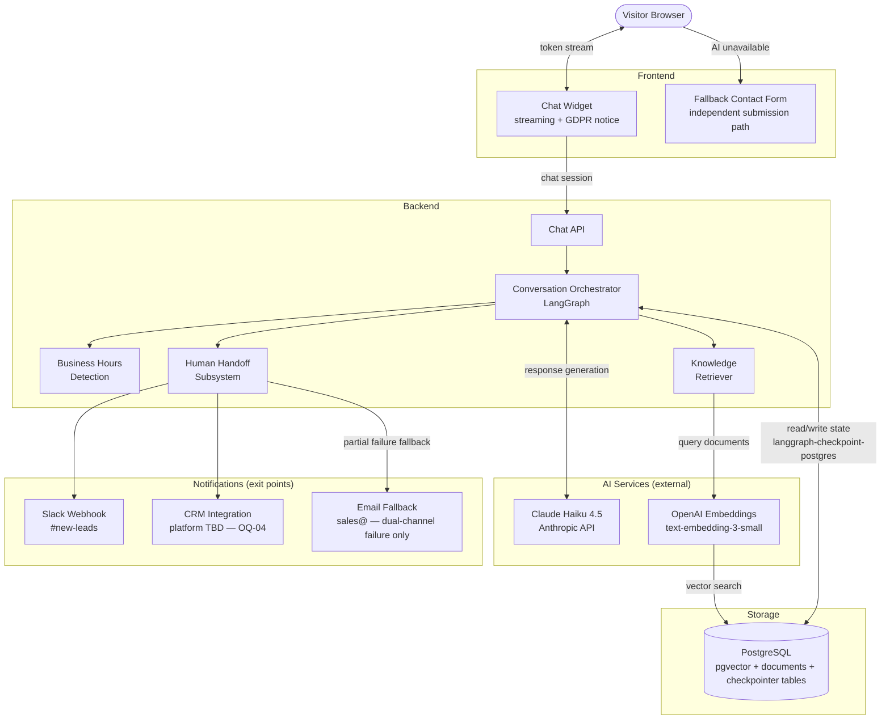
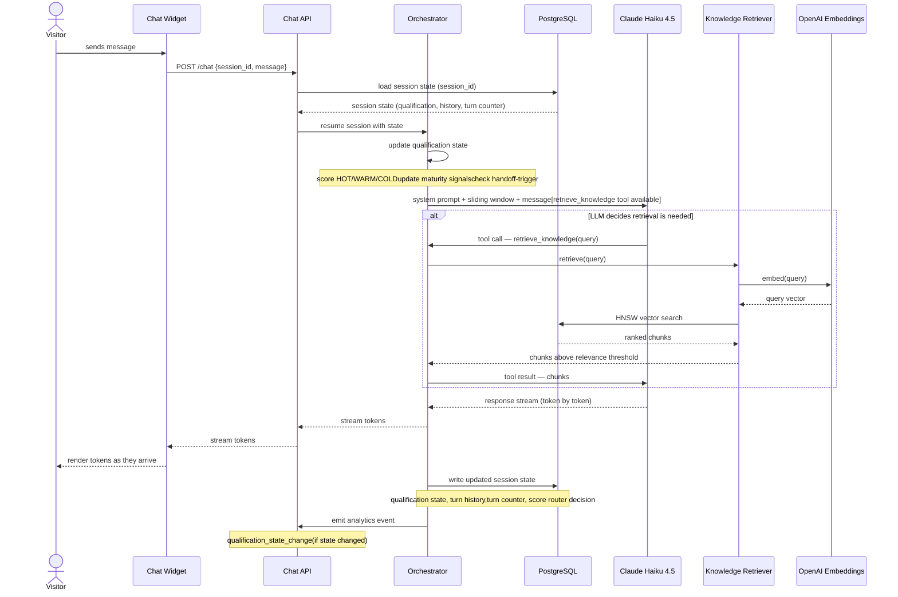

# System Architecture

## High-Level Architecture

The system consists of eight components. The chat widget is the sole entry point for visitor traffic. All AI processing runs server-side; the widget receives a token stream. The Knowledge Retriever executes vector search when the LLM determines domain content is required. Two external notification channels (Slack and CRM) are exit points for lead data. The fallback form operates independently of the AI backend.

> **One component has a pending decision that affects this diagram:**
>
> - **CRM platform (OQ-04):** Platform unconfirmed — owned by ops/commercial.
>   The Human Handoff Subsystem interface is specified in Section 3.4;
>   the CRM-specific adapter and lead record schema are defined in ADR-005
>   once OQ-04 is resolved. This blocks Section 5.2 and Phase 3 build.

---

## Component Responsibilities

| Component | Responsibility | Technology | References |
| --- | --- | --- | --- |
| Chat Widget | Embeds on the Zartis website; renders the conversation UI with streaming token display; shows GDPR data notice on first interaction; falls back to the contact form if the AI backend is unavailable | Custom JS / framework TBD | ADR (pending) |
| Fallback Contact Form | Captures visitor name and email when the AI service is unavailable; submits via a path independent of the AI backend | Static endpoint / third-party form service | EC-07 |
| Chat API | Authenticates the request, initiates or resumes a LangGraph session, pipes the token stream to the HTTP response | Backend API layer | ADR (pending) |
| Conversation Orchestrator | Controls the full session lifecycle: qualification state updates, RAG triage routing, response generation, stall detection, escalation trigger | LangGraph (`StateGraph`) | ADR-002 |
| Knowledge Retriever | Receives `retrieve_knowledge` tool calls from the LLM; embeds the query; executes HNSW vector search against pgvector; returns chunks above the relevance threshold | Internal module — pgvector + OpenAI Embeddings | ADR-003 |
| Business Hours Detection | Determines whether the current timestamp falls within business hours (Mon–Fri 09:00–18:00 CET/CEST); DST-aware via IANA identifier `Europe/Madrid` | Python `zoneinfo` | EC-04 |
| Human Handoff Subsystem | Generates the context packet; dispatches to Slack and CRM in parallel; handles partial failure; falls back to email on dual-channel failure | Internal module | EC-03, FR-19 |
| LLM — Claude Haiku 4.5 | Generates conversational responses; executes the three-stage conversation model; signals when domain retrieval is required via `retrieve_knowledge` tool call | Anthropic API | ADR-001 |
| OpenAI Embeddings | Converts query text to vectors at retrieval time; indexes document chunks at ingestion time | `text-embedding-3-small` | ADR-003 |
| PostgreSQL | Single storage backend: pgvector extension for document chunks and HNSW index; `langgraph-checkpoint-postgres` tables for session state | PostgreSQL + pgvector | ADR-003, ADR-004 |

---

## Data Flow — Happy Path

The following steps describe the primary data flow for a standard visitor turn that requires domain knowledge retrieval. Handoff and degradation flows are specified in Sections 3.4 and 10 respectively.

1. **Visitor sends a message.** The chat widget sends a chat session request
   with `{ session_id, message }` to the Chat API.

2. **Session load.** The checkpointer loads existing session state for
   `session_id` from PostgreSQL, or initialises a new session object if
   none exists. State includes qualification dimensions, maturity signals,
   turn counter, and conversation history (sliding window).

3. **Qualification node.** The orchestrator updates the qualification state
   based on the current message and conversation history. It sets `score`
   (HOT / WARM / COLD), updates maturity signal flags, and sets
   `handoff-trigger` if an explicit escalation request is detected.

4. **Response generation.** The orchestrator sends the full context (system
   prompt + sliding window + current message) to Claude Haiku 4.5 with the
   `retrieve_knowledge` tool available. The LLM decides per-turn whether to
   call the tool based on whether the question requires company domain content.

5. **Vector retrieval (conditional).** If the LLM calls `retrieve_knowledge`,
   the Knowledge Retriever embeds the query via `text-embedding-3-small`, runs
   HNSW vector search against pgvector, and returns chunks that exceed the
   configured relevance threshold. Below-threshold results are discarded. The
   orchestrator forwards the retrieved chunks to the LLM for final response
   generation.

6. **Token stream delivery.** The LLM streams the response token-by-token.
   The Chat API pipes the stream to the chat widget, which renders tokens as
   they arrive.

7. **State write.** The orchestrator writes updated session state to the
   PostgreSQL checkpointer. The `score?` router evaluates the new state and
   determines the next routing decision (return to USER REQUEST, PROPOSE
   HANDOFF, or stall path).

8. **Analytics event.** The backend emits the relevant analytics event
   (`qualification_state_change` if state changed). Event schema is defined
   in Section 9.3.
